## Today’s agenda

• Guided policy search (GPS)

• Expert iteration & learning to search

• Blending MPC and value function approximation (MPQ($\lambda$))

• Imitating motion capture with RL (DeepMimic)

• Combining behavioral cloning and RL

• Dynamic movement primitives (DMPs)

::: aside
Acknowledgments\
Today’s slides are based on student presentations from 2019 by: Yuwei Chen, Jienan Yao, and Jason Rebello as well as from YouTube recordings of lectures from Gregor Schöner, for his Autonomous Robotics course:\
<https://www.youtube.com/watch?v=IV8Eze9Hxrc&ab_channel=Dynamicfieldtheory>
:::

## 

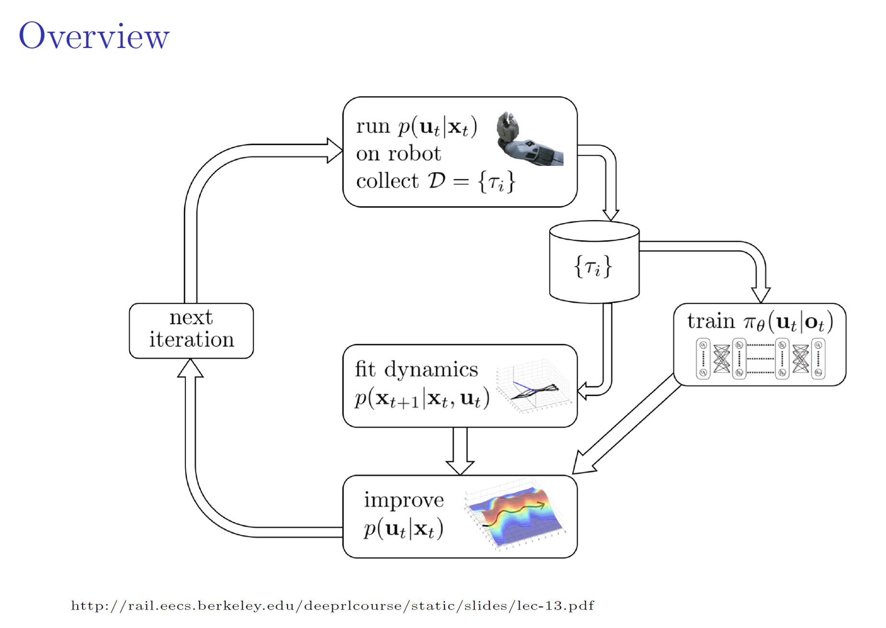

## 



[<https://www.youtube.com/watch?v=Q4bMcUk6pcw&t=40s&ab_channel=RAIL>]{.tiny-font}

## 

::::: columns
::: {.column width="70%"}
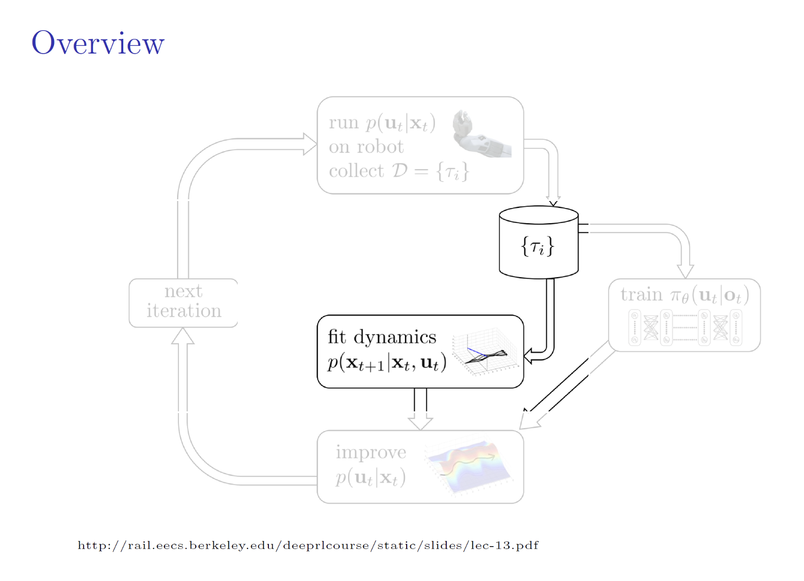
:::

::: {.column .small-math width="30%"}
 

$\boxed{\begin{aligned} p(x_{t+1} | x_t, u_t) &= \mathcal{N}(f(x_t, u_t), \Sigma) \\
f(x_t, u_t) &\approx A_t x_t + B_t u_t \\
A_t &= \frac{df}{dx_t} \quad B_t = \frac{df}{du_t}
\end{aligned}}$
:::
:::::

## 

:::::: columns
::: {.column width="60%"}
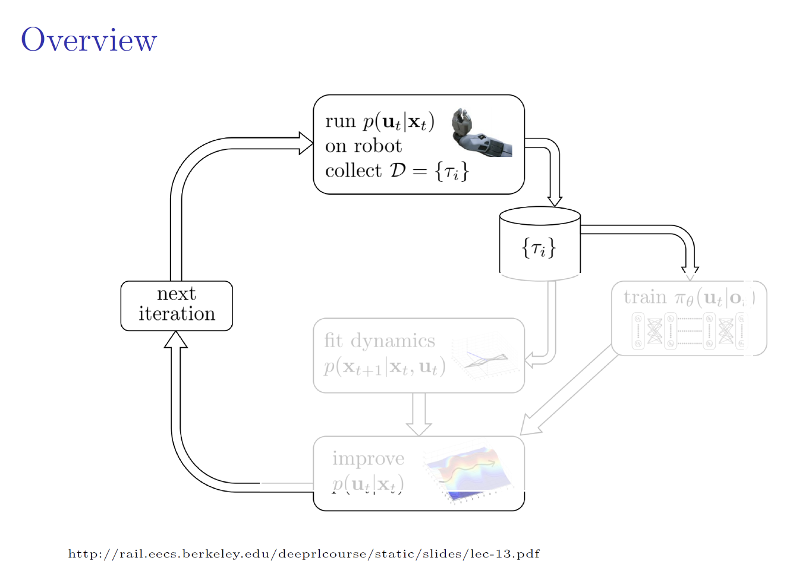
:::

:::: {.column .small-math width="40%"}
 

$\boxed{\begin{aligned} \text{iLQR/iLQG control} \\
\mathbf{u}_t = \mathbf{K}_t (\mathbf{x}_t - \hat{\mathbf{x}}_t) + \mathbf{k}_t + \hat{\mathbf{u}}_t \\
\text{is deterministic. We need it stochastic.}
\end{aligned}}$

  

::: fragment
$p(u_t \mid x_t) = \mathcal{N}(K_t (x_t - \hat{x}_t) + k_t + \hat{u}_t, \Sigma_t)$

    

$p(\tau) = p(x_1) \prod_{t=1}^{T} p(u_t \mid x_t) p(x_{t+1} \mid x_t, u_t)$
:::
::::
::::::

## Learning a globally-valid NN policy: an example

::: {style="color:red;"}
We want to solve a stochastic version of this problem
:::

$$
\begin{align}
\min_{\mathbf{u}_1, \ldots, \mathbf{u}_T, \mathbf{x}_1, \ldots, \mathbf{x}_T, \theta} \sum_{t=1}^{T} c(\mathbf{x}_t, \mathbf{u}_t) \text{s.t.} \mathbf{x}_t = f(\mathbf{x}_{t-1}, \mathbf{u}_{t-1}) \\
\text{s.t.} \mathbf{u}_t = \pi_\theta (\mathbf{x}_t)
\end{align}
$$

::: {style="color:red;"}
where both the policy and the dynamics are stochastic. I.e. we want to learn a globally-valid policy that imitates the actions of locally-valid iLQG policies.
:::

## KL-Divergence Constraints

 

::::: columns
::: {.column .small-math width="60%"}
▶ Modified cost function

$$
\min_{p(\tau) \in \mathcal{N}(\tau)} E_p[l(\tau)] \text{ s.t. } D_{\text{KL}}(p(\tau)||\hat{p}(\tau)) \leq \epsilon
$$
:::

::: {.column width="40%"}
:::
:::::

::: {.small-math .absolute top="100" right="0"}
$$
\begin{align}
\color{red} \leftarrow 
\boxed{
    \begin{align}
    \color{red}\text{Want to solve a stochastic version of} \\
    \color{black} \min_{u_1, \ldots, u_T, x_1, \ldots, x_T} \sum_{t=1}^{T} c(x_t, u_t) \quad \text{s.t.} \quad x_t = f(x_{t-1}, u_{t-1}) \\ 
    \color{red}\text{with an additional trust-region inequality constraint}
    \end{align}
    } \\
\end{align}
$$
:::

::: {.absolute .red-annotation top="300" right="0"}
$\color{black} \hat{p}(\tau)$ is the previous trajectory\
distribution. Same dynamics,\
different policy.
:::

## KL-Divergence Constraints

::::: small-math
▶ Modified cost function

$$
\min_{p(\tau) \in \mathcal{N}(\tau)} E_p[l(\tau)] \text{ s.t. } D_{\text{KL}}(p(\tau)||\hat{p}(\tau)) \leq \epsilon
$$

▶ Lagrangian of this problem ($\eta$ dual variable)

$$\mathcal{L}_{\text{traj}}(p(\tau), \eta) = E_p[l(\tau)] + \eta[D_{\text{KL}}(p(\tau)||\hat{p}(\tau)) - \epsilon]$$

▶ Assuming $p(\mathbf{x}_{t+1}|\mathbf{x}_t, \mathbf{u}_t) = \hat{p}(\mathbf{x}_{t+1}|\mathbf{x}_t, \mathbf{u}_t) = \mathcal{N}(f_{\mathbf{x}t}\mathbf{x}_t + f_{\mathbf{u}t}\mathbf{u}_t, \mathbf{F}_t)$

$$
\mathcal{L}_{\text{traj}}(p(\tau), \eta) = \left[\sum_t E_{p(\mathbf{x}_t, \mathbf{u}_t)}[l(\mathbf{x}_t, \mathbf{u}_t) - \eta \log \hat{p}(\mathbf{u}_t|\mathbf{x}_t)]\right] - \eta H(p(\tau)) - \eta \epsilon
$$

[Derivation]{#gps-lagrangian-toggle .proof-toggle} (click to show / hide)

::: {#gps-lagrangian-derivation .derivation-content .medium}
$$
\begin{aligned}
D_{\text{KL}}(p(\tau)\,\|\,\hat{p}(\tau)) &= E_p[\log p(\tau)] - E_p[\log \hat{p}(\tau)] = -H(p(\tau)) - E_p[\log \hat{p}(\tau)] \\
\log \hat{p}(\tau) &= \log p(\mathbf{x}_1) + \textstyle\sum_t \log \hat{p}(\mathbf{u}_t|\mathbf{x}_t) + \sum_t \log p(\mathbf{x}_{t+1}|\mathbf{x}_t, \mathbf{u}_t) && \text{same dynamics as } p \\
E_{p(\mathbf{x}_{t+1}|\mathbf{x}_t, \mathbf{u}_t)}[\log p(\mathbf{x}_{t+1}|\mathbf{x}_t, \mathbf{u}_t)] &= -\tfrac{1}{2}\log\left|2\pi e\, \mathbf{F}_t\right| && \text{constant w.r.t. } p
\end{aligned}
$$

Plug these into the Lagrangian, use $l(\tau) = \sum_t l(\mathbf{x}_t, \mathbf{u}_t)$ so that each expectation only needs the marginal $p(\mathbf{x}_t, \mathbf{u}_t)$, and drop the initial-state and dynamics terms, which do not depend on $p$. The linear-Gaussian assumption with a fixed $\mathbf{F}_t$ is what makes the dynamics term constant: with general dynamics its entropy would depend on $(\mathbf{x}_t, \mathbf{u}_t)$, i.e. on which states $p$ visits.
:::

::: fragment
▶ Augmented cost function

$$\tilde{l}(\mathbf{x}_t, \mathbf{u}_t) = \frac{1}{\eta}l(\mathbf{x}_t, \mathbf{u}_t) - \log \hat{p}(\mathbf{u}_t|\mathbf{x}_t)$$
:::

::: fragment
▶ Solved by dual gradient descent
:::
:::::

## Dual Gradient Descent

:::::: {.columns .small-math}
::: {.column width="30%"}
$\min_x f(x) \quad \text{s.t.} \quad C(x) = 0$
:::

::: {.column width="30%"}
$L(x, \lambda) = f(x) + \lambda C(x)$
:::

::: {.column width="30%"}
$g(\lambda) = L(x^*(\lambda), \lambda)$
:::
::::::

. . .

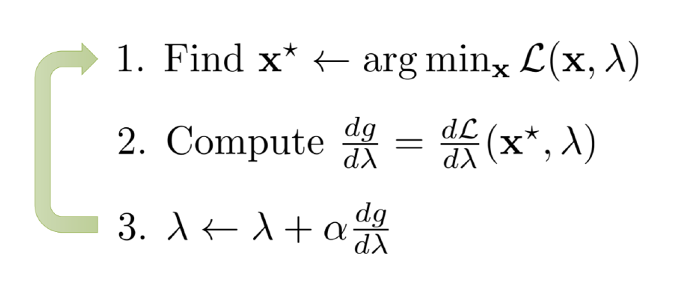{height="200"}

[<http://rail.eecs.berkeley.edu/deeprlcourse/static/slides/lec-13.pdf>]{.tiny-font}

## General Parameterized Policies

:::: small-math
▶ Objective

$$
\min_{\theta,\, p(\tau)} \mathbb{E}_{p(\tau)}[\ell(\tau)] \quad \text{s.t.} \quad D_{KL}(p(x_t)\pi_\theta(u_t|x_t)\,\|\,p(x_t, u_t)) = 0,\ \forall t
$$

▶ Lagrangian of the problem $$
\begin{align}
\mathcal{L}_{GPS}(\theta, p, \lambda) &= \mathbb{E}_{p(\tau)}[\ell(\tau)] + \sum_{t=1}^{T} \lambda_t D_{KL}(p(x_t)\pi_\theta(u_t|x_t)\,\|\,p(x_t, u_t)) \\
\end{align}
$$

::: {.center-align .fragment}
[OR]{.red} $$
\qquad \qquad \qquad \qquad \qquad \qquad = \mathbb{E}_{p(\tau)}[\ell(\tau) - \eta\log\hat{p}(\tau)] - \eta\mathcal{H}(p) + \sum_{t=1}^{T} \lambda_t D_{KL}(p(x_t)\pi_\theta(u_t|x_t)\,\|\,p(x_t, u_t))
$$

[if we include the trust-region constraint]{.red}
:::
::::

## General Parameterized Policies

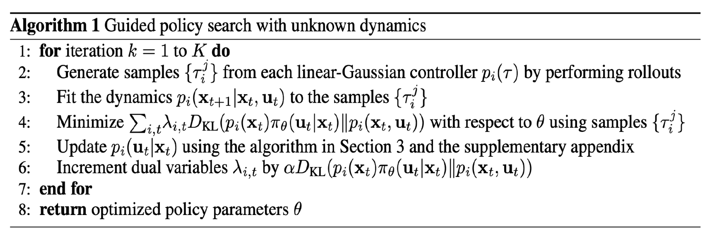

## Experiments Conducted

▶ 2D, 3D peg insertion (discontinuous dynamics)

▶ Octopus arm control (high-dimensional state and action space)

▶ Planar swimming (three-link snake)

▶ Walking (seven-link biped to maintain a target velocity)

## Trajectory Optimization

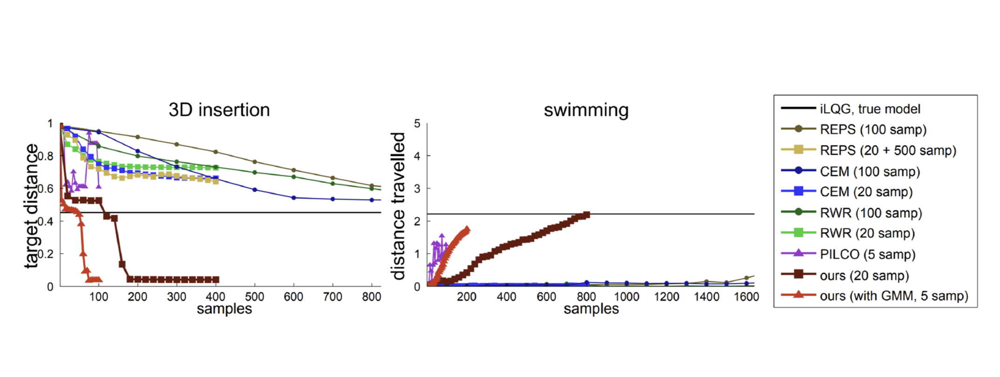

## Trajectory Optimization

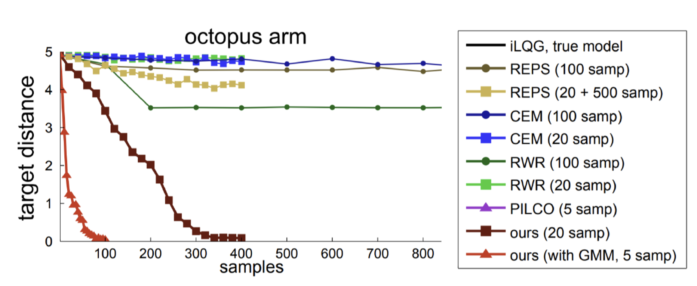

## Neural Network Policy Learning with GPS

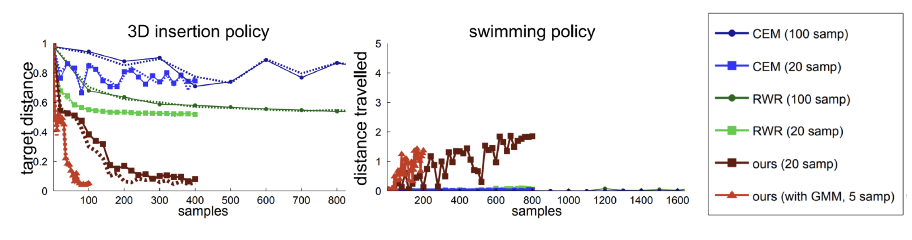

## Training with privileged information

 

::::: columns
::: {.column width="50%"}
$$
\boxed{
    \begin{align}
\min_{p,\, \theta} \mathbb{E}_{\tau \sim p(\tau)}[c(\tau)] \quad \\
\text{s.t.} \quad p(u_t \mid x_t) = \pi_{\theta}(u_t \mid x_t)
\end{align}
}
$$
:::

::: {.column width="50%"}
$$
\boxed{
    \begin{align}
\min_{p,\, \theta} \mathbb{E}_{\tau \sim p(\tau)}[c(\tau)] \quad \\
\text{s.t.} \quad p(u_t \mid x_t) = \pi_{\theta}(u_t \mid o_t)
\end{align}
}
$$
:::
:::::

## Today’s agenda

::: grey-text
• Guided policy search (GPS)
:::

• Expert iteration & learning to search

• Blending MPC and value function approximation (MPQ($\lambda$))

• Imitating motion capture with RL (DeepMimic)

• Combining behavioral cloning and RL

• Dynamic movement primitives (DMPs)

::: aside
Acknowledgments\
Today’s slides are based on student presentations from 2019 by: Yuwei Chen, Jienan Yao, and Jason Rebello as well as from YouTube recordings of lectures from Gregor Schöner, for his Autonomous Robotics course:\
<https://www.youtube.com/watch?v=IV8Eze9Hxrc&ab_channel=Dynamicfieldtheory>
:::

## From Search to Learning and Back

::::::::::::: {.columns style="font-size:0.6em;"}
::::: {.column width="30%"}
Logic Geometric Programming\
Marc Toussaint et al. IJCAI’15, RSS’17

PDDLStream Planners\
Caelan Garret et al. ICAPS’20

TAMP = SMT + Motion Planning\
Neil Dantam et al. IJRR’18

. . .

::: red
$-$ Need to specify symbols / logic

$-$ Slow to plan, not very reactive
:::

::: green
$+$ Generalize

$+$ No training data
:::
:::::

::: {.column width="5%"}
:::

:::: {.column .fragment width="30%" fragment-index="2"}
Learning to Guide TAMP\
Beomjoom Kim et al., AAAI’18

PLOI\
Tom Silver, Rohan Chitnis et al. AAAI’21

Deep Visual Heuristics\
Danny Driess et al. ICRA’20

Learning to Search for TAMP\
Mohamed Khodeir et al. RAL’22, ICRA’23

Text2Motion\
Chris Agia et al. ICRA’23

[$-$ Need to specify symbols / logic]{.red}

[$+$ Can be made fast, reactive]{.light-orange}

::: green
$+$ Generalize

$+$ Few training data needed
:::
::::

::: {.column width="4%"}
:::

::::: {.column .right-align .fragment width="30%" fragment-index="1"}
PaLM-E\
Danny Driess et al. ‘23

SayCan\
Michael Ahn et al. CoRL‘23

RT-1\
Anthony Brohan et al. ‘22

Deep Affordance Foresight\
Danfei Xu et al. ICRA’21

PlaNet, Dreamer, Hierarchical RL\
Danijar Hafner et al.

::: green
$+$ Symbols not needed

$+$ Fast, reactive
:::

::: red
$-$ Do not generalize

$-$ Large data regime
:::
:::::
:::::::::::::

## Learning to Plan via Expert Iteration

 

::::: columns
::: {.column width="50%"}
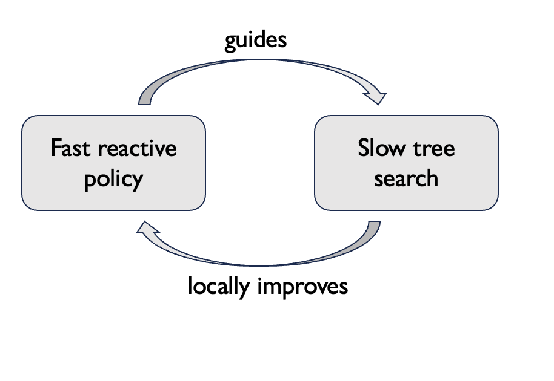
:::

::: {.column width="50%"}
If we do multiple rounds of heuristic learning and tree search, we could potentially get:

• monotonic improvement guarantees for the policy / planning heuristic

• convergence to a point where tree search and the policy are equally good
:::
:::::

::: tiny-font
Dual Policy Iteration. Sun, Gordon, Boots, Bagnell. NeurIPS’18.\
Thinking Fast and Slow with Deep Learning and Tree Search. Anthony, Tian, Barber. NeurIPS’17.\
AlphaGo Zero: Mastering the Game of Go Without Human Knowledge. Silver, Schrittwieser, Simonyan, Antonoglou. Nature’17.
:::

## AlphaGo Zero

::::: columns
::: {.column width="50%"}
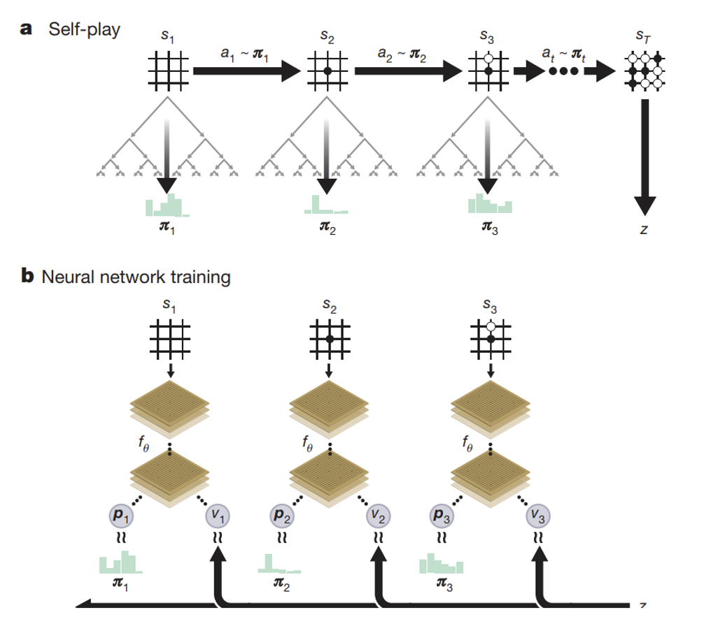
:::

::: {.column width="50%"}
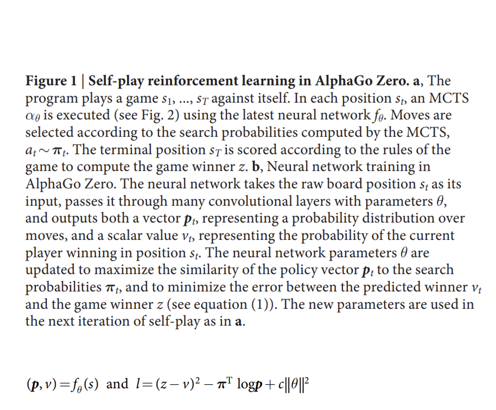
:::
:::::

[AlphaGo Zero: Mastering the Game of Go Without Human Knowledge. Silver, Schrittwieser, Simonyan, Antonoglou. Nature’17.]{.tiny-font}

## MCTS in AlphaGo Zero

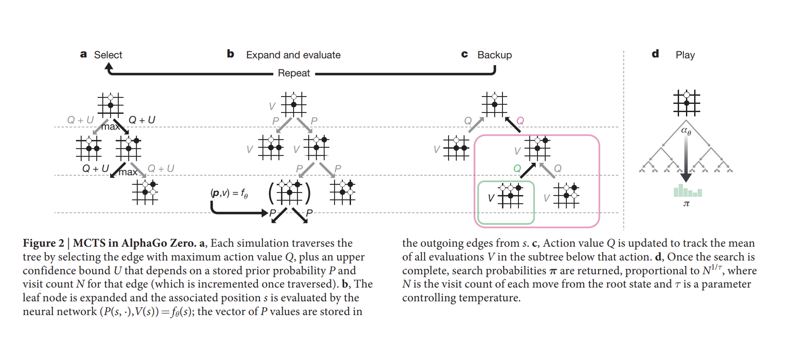

[AlphaGo Zero: Mastering the Game of Go Without Human Knowledge. Silver, Schrittwieser, Simonyan, Antonoglou. Nature’17.]{.tiny-font}

## 

::::: columns
::: {.column width="50%"}
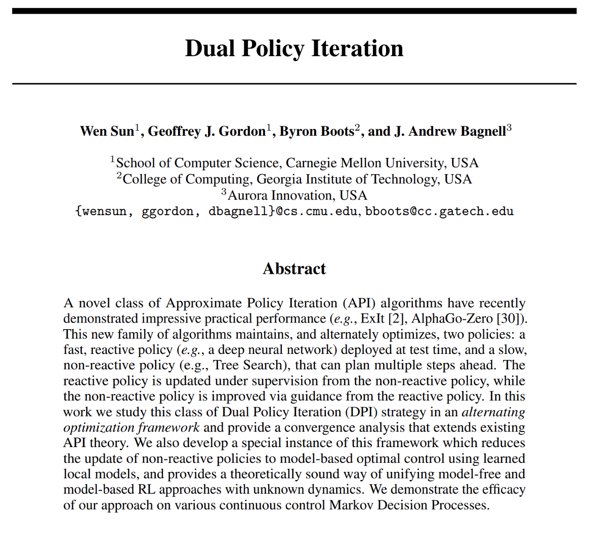
:::

::: {.column .red .small-math width="50%"}
  

A policy optimization framework that includes

-   Guided Policy Search
-   Expert Iteration
-   AlphaGo Zero
-   “Thinking fast and slow”
-   AggreVaTeD (a varianbt of DAgger)

as special cases and provides conditions under which we expect monotonic improvement of the fast, reactive policy.
:::
:::::

## 

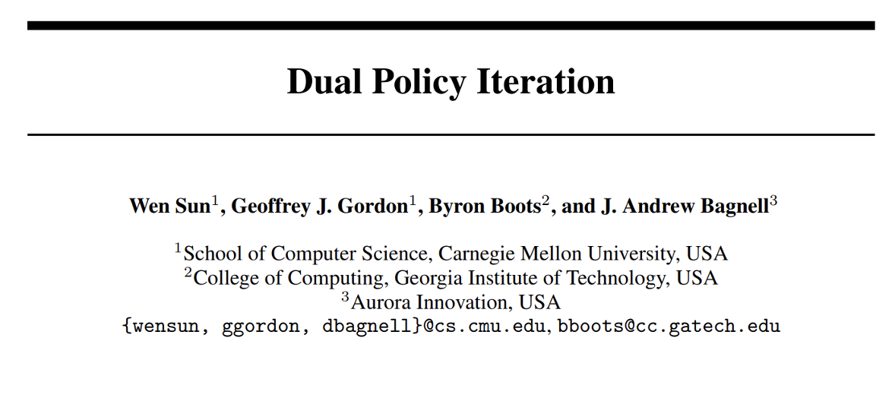{height="300"}

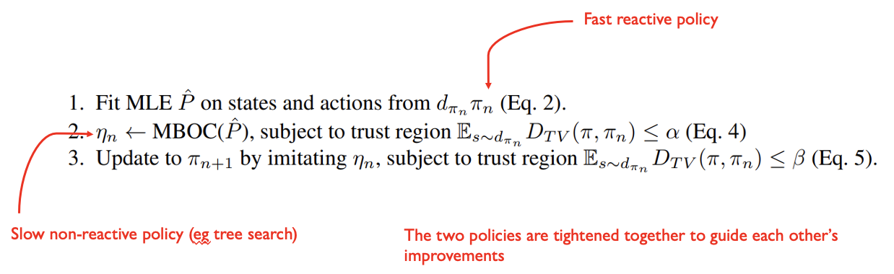

## 

{height="300"}

::: small-math
$$
\begin{array}{ll}
\text{1.} & \text{Fit MLE } \hat{P} \text{ on states and actions from } d_{\pi_n} \pi_n \text{ (Eq. 2).} \\
\text{2.} & \eta_n \leftarrow \text{MBOC}(\hat{P}), \text{ subject to trust region } \mathbb{E}_{s \sim d_{\pi_n}} D_{TV}(\pi, \pi_n) \leq \alpha \text{ (Eq. 4)} \\
\text{3.} & \boxed{\text{Update to } \pi_{n+1} \text{ by imitating } \eta_n, \text{ subject to trust region } \mathbb{E}_{s \sim d_{\pi_{\eta}}} D_{TV}(\pi, \pi_n) \leq \beta \text{ (Eq. 5)}}
\end{array}
$$
:::

::: center-align
[Main difference with respect to Guided Policy Search]{.red-annotation}
:::

::: tiny-font
GPS, including the mirror descent version, phrases the update procedure of the reactive policy as\
a *behavior cloning procedure*, i.e., given an expert policy $\eta$, we perform $\min_{\pi} D_{KL}(d_{\mu \mu} \,\|\, d_{\pi \pi})^3$\
Note that our approach to updating $\pi$ is fundamentally on-policy, i.e., we generate samples from $\pi$.
:::

## Today’s agenda

::: grey-text
• Guided policy search (GPS)

• Expert iteration & learning to search
:::

• Blending MPC and value function approximation (MPQ($\lambda$))

• Imitating motion capture with RL (DeepMimic)

• Combining behavioral cloning and RL

• Dynamic movement primitives (DMPs)

::: aside
Acknowledgments\
Today’s slides are based on student presentations from 2019 by: Yuwei Chen, Jienan Yao, and Jason Rebello as well as from YouTube recordings of lectures from Gregor Schöner, for his Autonomous Robotics course:\
<https://www.youtube.com/watch?v=IV8Eze9Hxrc&ab_channel=Dynamicfieldtheory>
:::

## Blending MPC & Value Function Approximation

::: {.small-math .arrow-bullets}
**Motivation:** MPC is practical, but real-time budgets force *simple, approximate* models. Model bias compounds over the horizon and caps performance. Model-free RL has no model bias, but needs too much data.

::: fragment
▶ Prior work (e.g. AlphaGo, POLO, MPQ) learns a **terminal** value function to extend the effective horizon of MPC.

▶ But the learned value is only invoked at step $H$ and model error still accumulates *inside* the horizon.
:::

::: fragment
::: {style="color:red;"}
Question: can learning both extend the horizon of MPC **and** correct for model bias?
:::
:::
:::

::: aside
Bhardwaj, Choudhury, Boots. *Blending MPC & Value Function Approximation for Efficient Reinforcement Learning.* ICLR 2021.\
[<https://arxiv.org/abs/2012.05909>]{.tiny-font}
:::

## MPC as a series of local Q-function approximations

::::: {.small-math .arrow-bullets}
▶ MPC solves a **surrogate MDP** $\hat{M} = (S, A, \hat{c}, \hat{P}, \gamma, \hat{\mu}, H)$ online, with approximate cost $\hat{c}$, approximate dynamics $\hat{P}$, finite horizon $H$, terminal value $\hat{Q}$, and start-state distribution $\hat{\mu}$:

$$
Q^{\pi_{\phi}}_H(s,a) = \mathbb{E}_{\hat{\mu}, \pi_{\phi}, \hat{P}}\left[\sum_{i=0}^{H-1} \gamma^i \hat{c}(s_i, a_i) + \gamma^H \underbrace{\hat{Q}(s_H, a_H)}_{\text{terminal state-action value}} \;\Big|\; s_0 = s,\, a_0 = a\right] \tag{1}
$$

▶ At the current state $s_t$, MPC optimizes action distribution: 

$$
\arg\min_{\phi} \; \mathbb{E}_{a_t \sim \pi_{\phi}(a|s_t)}\left[ Q^{\pi_{\phi}}_H(s_t, a_t) \right]
$$

::: fragment
▶ Equivalently, via a telescoping sum, we can define $A(s_i,a_i) = \hat{c}(s_i,a_i) + \gamma \hat{Q}(s_{i+1},a_{i+1}) - \hat{Q}(s_i,a_i)$ and\
formulate (1) in terms of the 1-step disadvantage w.r.t. $\hat{Q}$:

$$
 \mathbb{E}_{\hat{\mu}, \pi_{\phi}, \hat{P}}\left[\hat{Q}(s_0,a_0) + \sum_{i=0}^{H-1} \gamma^i A(s_i,a_i) \;\Big|\; s_0 = s\right]
$$

[This form is exactly equivalent to (1), so it does **not** yet fix model bias, but it is the form we will modify.]{.red}
:::
:::::

## Error as a function of H

::: {.small-math .arrow-bullets}
1.  **Model bias** compounds along predicted trajectories → worse as $H \to \infty$.
2.  **Terminal value error** propagates back to $s_0$, but is discounted → better as $H \to \infty$.
3.  **Myopic behavior**: small $H$ with an inaccurate $\hat{Q}$ makes the controller greedy.

::: fragment
**Theorem 3.1.** If $\hat{M}$ is an $\alpha$-approximation of $M$ ($\lVert \hat{P} - P \rVert_1 \leq \alpha$, $\lvert \hat{c} - c \rvert \leq \alpha$) and $\lVert \hat{Q} - Q^{\pi^*}_M \rVert_\infty \leq \epsilon$, then the $H$-step greedy policy satisfies

$$
\left\lVert V^{\pi^*}_M - V^{\hat{\pi}}_M \right\rVert_\infty \leq 2\left(\frac{\gamma(1-\gamma^{H-1})}{(1-\gamma^H)(1-\gamma)}\alpha H \frac{c_{\max}-c_{\min}}{2} + \frac{\gamma^H \alpha H}{1-\gamma^H}\frac{V_{\max}-V_{\min}}{2} + \frac{\alpha}{1-\gamma} + \frac{\gamma^H \epsilon}{1-\gamma^H}\right)
$$
:::

::: fragment
▶ [Model error grows with $H$; value error shrinks with $H$.]{.red}
:::
:::

## Key idea: blending with $\lambda$

::::: {.small-math .arrow-bullets}
▶ Naive blend (value function as a residual on the MPC output) is *ad hoc*, it uses $\hat{Q}$ only at the ends:

$$
\underbrace{(1-\lambda)\hat{Q}(s,a)}_{\text{model-free}} + \underbrace{\lambda Q^{\phi}_H(s,a)}_{\text{model-based}}
$$

::: fragment
▶ Instead, define a **recursive** blend that invokes $\hat{Q}$ at *every* step of the horizon:

$$
\underbrace{Q^{\lambda}(s_i,a_i)}_{\text{current blended estimate}} = \underbrace{(1-\lambda)\hat{Q}(s_i,a_i)}_{\text{model-free}} + \lambda\big(\underbrace{\hat{c}(s_i,a_i)}_{\text{model-based}} + \gamma \underbrace{Q^{\lambda}(s_{i+1},a_{i+1})}_{\text{future blended estimate}}\big), \qquad Q^{\lambda}(s_H,a_H) = \hat{Q}(s_H,a_H)
$$
:::

::: fragment
▶ Unrolling gives an **exponentially weighted average over all horizon estimates** $Q^{\phi}_i$:

$$
Q^{\lambda}_H(s,a) = (1-\lambda)\sum_{i=0}^{H-1}\lambda^i Q^{\phi}_i(s,a) + \lambda^H Q^{\phi}_H(s,a)
\qquad
\boxed{\lambda = 0 \Rightarrow \hat{Q}, \quad \lambda = 1 \Rightarrow \text{plain MPC}}
$$
:::

::: fragment
▶ Running $H$ copies of MPC would be far too expensive, but the same telescoping trick makes it **free**: every horizon estimate $Q^{\phi}_i$ is a *prefix* of the one $H$-step rollout MPC already simulates, so all we do is discount each per-step term by an extra $\lambda^i$.

$$
Q^{\lambda}_H(s,a) = \mathbb{E}_{\hat{\mu}, \pi_{\phi}, \hat{P}}\left[\hat{Q}(s_0,a_0) + \lambda\sum_{i=0}^{H-1}(\gamma\lambda)^i A(s_i,a_i)\right] \tag{2}
$$

[Same form as TD($\lambda$), but here $\lambda$ trades off **model bias vs. value-function bias**, not bias vs. variance.]{.red}
:::
:::::

## Deriving the telescoped form of Eqn (2)

::::: {.small-math .arrow-bullets}
▶ Write $\hat{Q}_i \equiv \hat{Q}(s_i,a_i)$, $\hat{c}_i \equiv \hat{c}(s_i,a_i)$, $Q^{\lambda}_i \equiv Q^{\lambda}(s_i,a_i)$, and track the gap $\Delta_i \equiv Q^{\lambda}_i - \hat{Q}_i$ between the blend and the value function. The recursion ends at $Q^{\lambda}_H = \hat{Q}_H$, so $\Delta_H = 0$.

▶ Subtract $\hat{Q}_i$ from both sides of the recursion, then add and subtract $\gamma\hat{Q}_{i+1}$:

$$
\begin{aligned}
\Delta_i &= (1-\lambda)\hat{Q}_i + \lambda\big(\hat{c}_i + \gamma Q^{\lambda}_{i+1}\big) - \hat{Q}_i = \lambda\big(\hat{c}_i + \gamma Q^{\lambda}_{i+1} - \hat{Q}_i\big) \\
&= \lambda\underbrace{\big(\hat{c}_i + \gamma\hat{Q}_{i+1} - \hat{Q}_i\big)}_{A(s_i,a_i)} + \gamma\lambda\underbrace{\big(Q^{\lambda}_{i+1} - \hat{Q}_{i+1}\big)}_{\Delta_{i+1}}
\end{aligned}
$$

::: fragment
▶ So $\Delta_i = \lambda A(s_i,a_i) + (\gamma\lambda)\,\Delta_{i+1}$ is a one-step recursion with $\Delta_H = 0$. Unrolling it from $i=0$:

$$
Q^{\lambda}_H(s,a) = \hat{Q}(s_0,a_0) + \Delta_0 = \mathbb{E}_{\hat{\mu}, \pi_{\phi}, \hat{P}}\left[\hat{Q}(s_0,a_0) + \lambda\sum_{i=0}^{H-1}(\gamma\lambda)^i A(s_i,a_i)\right]
$$
:::

::: fragment
▶ Check the endpoints: $\lambda = 0$ leaves $\hat{Q}(s_0,a_0)$, and $\lambda = 1$ telescopes back to $\sum_i \gamma^i \hat{c}_i + \gamma^H \hat{Q}_H = Q^{\pi_{\phi}}_H$.

▶ Every $A(s_i,a_i)$ is read off the **same** rollout, so the blend costs one $H$-step rollout, not $H$ of them.

[Eq. (8) in the paper drops the leading $\lambda$. That version is TD($\lambda$)'s weighting, $(1-\lambda)\lambda^{i-1}$ starting at the **1-step** estimate, so at $\lambda = 0$ it collapses to $\hat{c}_0 + \gamma\hat{Q}_1$ rather than to $\hat{Q}$]{.red}
:::
:::::

## The MPQ($\lambda$) algorithm

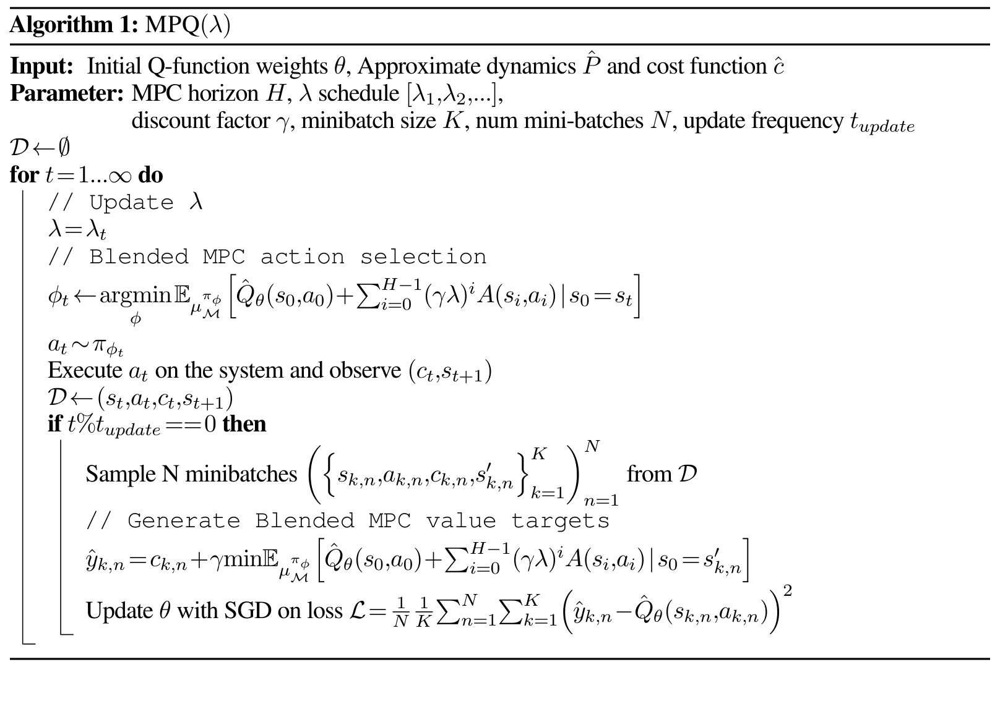{height="400"}

::: {.small-math .arrow-bullets}
▶ MPC (here MPPI) optimizes the *blended* estimate for action selection **and** for generating Q-targets.

▶ $\lambda$ is **decayed** over training: trust the model early, trust $\hat{Q}_\theta$ as it becomes accurate.
:::

## Results

:::: columns
::: {.column width="50%"}
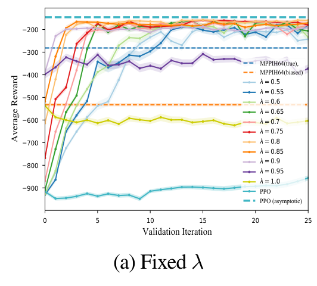{height="330"}

[CartPoleSwingup, mass bias $b=-0.5$, $H=64$]{.tiny-font}
:::

::: {.column width="50%"}
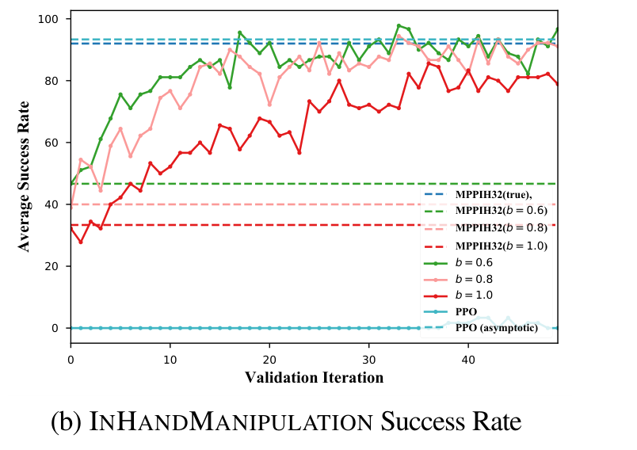{height="330"}

[24-DOF hand, biased mass/inertia/friction]{.tiny-font}
:::
::::

::: {.small-math .arrow-bullets}
▶ A wide range of $\lambda$ beats MPPI with the biased model, and even MPPI with the **true** dynamics. $\lambda \approx 1$ (pure MPC) and $\lambda < 0.6$ both degrade.

▶ Far more sample-efficient than model-free RL. PPO does not improve at all on in-hand manipulation over 150k steps.

▶ Robust to horizon, particle count, and large model bias, but if the model is *extremely* uninformative, leaning on MPC hurts.
:::

## Today’s agenda

::: grey-text
• Guided policy search (GPS)

• Expert iteration & learning to search

• Blending MPC and value function approximation (MPQ($\lambda$))
:::

• Imitating motion capture with RL (DeepMimic)

• Combining behavioral cloning and RL

• Dynamic movement primitives (DMPs)

::: aside
Acknowledgments\
Today’s slides are based on student presentations from 2019 by: Yuwei Chen, Jienan Yao, and Jason Rebello as well as from YouTube recordings of lectures from Gregor Schöner, for his Autonomous Robotics course:\
<https://www.youtube.com/watch?v=IV8Eze9Hxrc&ab_channel=Dynamicfieldtheory>
:::

## 



[<https://www.youtube.com/watch?v=vppFvq2quQ0>]{.tiny-font}

## Problem setup

::: {.small-math .arrow-bullets}
▶ **State** $s_t$: link positions, orientations (quaternions), and linear/angular velocities, all expressed in a character-local frame, plus a **phase variable** $\phi \in [0,1]$ marking where in the clip we are ($\phi = 0$ start, $\phi = 1$ end).

▶ The phase is what makes the problem Markov: without it the target pose depends on time, and the same character pose would demand different actions at different points in the clip.

▶ **Action** $a_t$: target joint angles for PD controllers, not torques. The policy is queried at 30 Hz; the PD controllers run at simulation rate and act as a low-level stabilizer, which speeds up learning considerably.

▶ **Goal** $g$: task-specific and optional (desired heading, target to strike), so the policy is $\pi_\theta(a \mid s, g)$ with value function $V_\psi(s,g)$.

▶ Trained with **PPO**; both networks are two fully-connected layers with ReLU. Terrain-aware variants prepend a small conv net over a heightmap.
:::

## The reward: imitation + task

::::: {.small-math .arrow-bullets}
▶ Total reward mixes tracking the clip with doing the job:

$$
r_t = w^I r^I_t + w^G r^G_t, \qquad w^I = 0.7,\ w^G = 0.3
$$

▶ The imitation term is a weighted sum of four **bounded** similarity measures, each an exponential of a squared error (so it saturates rather than demanding impossible precision):

$$
r^I_t = \underbrace{0.65}_{w^p} r^p_t + \underbrace{0.10}_{w^v} r^v_t + \underbrace{0.15}_{w^e} r^e_t + \underbrace{0.10}_{w^c} r^c_t
$$

::: fragment
$$
\begin{aligned}
r^p_t &= \exp\Big[-2\textstyle\sum_j \|\hat{q}^j_t \ominus q^j_t\|^2\Big] &&\text{joint orientations} \\
r^v_t &= \exp\Big[-0.1\textstyle\sum_j \|\dot{\hat{q}}^j_t - \dot{q}^j_t\|^2\Big] &&\text{joint velocities} \\
r^e_t &= \exp\Big[-40\textstyle\sum_e \|\hat{p}^e_t - p^e_t\|^2\Big] &&\text{hands and feet} \\
r^c_t &= \exp\Big[-10\|\hat{p}^c_t - p^c_t\|^2\Big] &&\text{centre of mass}
\end{aligned}
$$

[Hats denote the reference clip; $\ominus$ is the quaternion difference. End-effectors get the sharpest coefficient: feet in the wrong place read as a different skill.]{.red}
:::
:::::

## What actually makes it work

::: {.small-math .arrow-bullets}
▶ **Reference state initialization (RSI):** at the start of each episode sample a phase $\phi \sim U[0,1]$ and initialize the character from the clip at that phase. Otherwise the agent must master the takeoff of a backflip before it ever *sees* the reward for landing one; exploration never reaches the later part of the clip.

▶ **Early termination (ET):** end the episode, with zero reward for all remaining steps, as soon as the torso or head touches the ground. This kills the local optimum of falling over and collecting partial pose reward while lying down, and re-weights the data toward states the policy still has a chance in.

::: fragment
▶ Ablation, normalized return:

|   | Backflip | Sideflip |
|---|---|---|
| RSI + ET | **0.791** | **0.823** |
| ET only (no RSI) | 0.379 | 0.355 |

▶ Without RSI the character learns a small backwards hop while staying upright, never the mid-air rotation. [Two initialization/termination choices matter more here than the RL algorithm itself.]{.red}
:::
:::

## Many clips, one character

::: {.small-math .arrow-bullets}
▶ **Multi-clip reward:** $r^I_t = \max_{j=1,\dots,k} r^j_t$: reward the best-matching clip at each step, so the policy is never forced to commit to one demonstration.

▶ **Skill selector:** feed a one-hot clip id as extra input, and a single policy covers a repertoire on demand.

▶ **Composite policy** from separately trained skills, arbitrated by their own value functions:

$$
\Pi(a \mid s) = \sum_i p^i(s)\, \pi^i(a \mid s), \qquad p^i(s) = \frac{\exp[V^i(s)/\mathcal{T}]}{\sum_j \exp[V^j(s)/\mathcal{T}]}
$$

::: fragment
▶ Characters: humanoid (34 DOF), Atlas (31), T-Rex (55), dragon (79). Skills: walk/run, cartwheel, back/front/side flip, spin-kick, getup, vault, baseball pitch, terrain traversal from a heightmap.

▶ Adding the task reward matters: strike success **99% vs 19%**, throwing accuracy **75% vs 5%**, against imitation-only policies.

▶ [Cost and limits: 41M–191M samples and *days* per skill; the phase variable locks in the clip's timing; the similarity metric in the reward is hand-designed.]{.red}
:::
:::

## Today’s agenda

::: grey-text
• Guided policy search (GPS)

• Expert iteration & learning to search

• Blending MPC and value function approximation (MPQ($\lambda$))

• Imitating motion capture with RL (DeepMimic)
:::

• Combining behavioral cloning and RL

• Dynamic movement primitives (DMPs)

::: aside
Acknowledgments\
Today’s slides are based on student presentations from 2019 by: Yuwei Chen, Jienan Yao, and Jason Rebello as well as from YouTube recordings of lectures from Gregor Schöner, for his Autonomous Robotics course:\
<https://www.youtube.com/watch?v=IV8Eze9Hxrc&ab_channel=Dynamicfieldtheory>
:::

## Learning Complex Dexterous Manipulation with Deep Reinforcement Learning and Demonstrations

[https://arxiv.org/abs/1709.10087](https://arxiv.org/abs/1709.10087)

## 



[<https://www.youtube.com/watch?v=jJtBll8l_OM>]{.tiny-font}

## Motivation

::::: columns
::: {.column width="70%"}
• Dexterous multi-fingered hands are ***extremely versatile***

• ***Control*** is challenging due to high dimensionality, complex contact patterns

• Previous methods require ***reward shaping***

• DRL limited to ***simpler manipulators and simple tasks***

• Lack of physical systems due to ***sample inefficiency***
:::

::: {.column width="30%"}
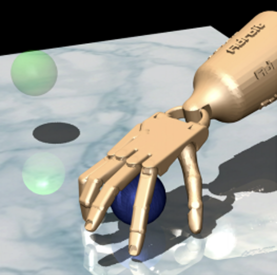
:::
:::::

## Contributions

::::: columns
::: {.column width="70%"}
• Manipulation with ***24-DOF*** hand

• ***Model Free*** DRL

• Used in ***complex tasks with variety of tools***

• Small number of ***human demonstrations*** reduces sample complexity

• ***Reduces learning time***

• ***Robust*** and natural movements
:::

::: {.column width="30%"}
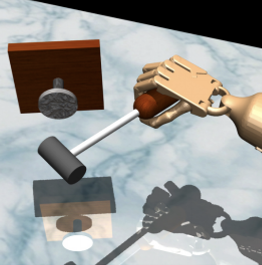
:::
:::::

## Manipulation Task 1

[***Object Relocation***]{.underline}

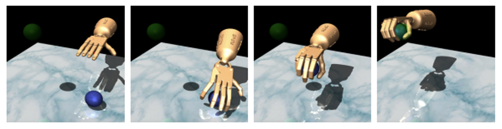

• Move Blue ball to green position

• Task complete when ball is epsilon ball away from target

• Positions of ball and target are randomized

• Main challenge is exploration (reach object, grab and move to target location)

## Manipulation Task 2

[***In-hand Manipulation***]{.underline}

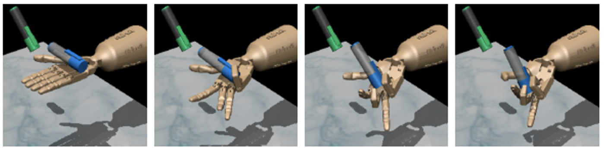

• Reposition blue pen to match orientation of green target

• Task complete when orientation is achieved

• Base of hand is fixed

• Large number of contacts with complex solutions

• Used a well shaped reward for training an expert

## Manipulation Task 3

[***Door Opening***]{.underline}

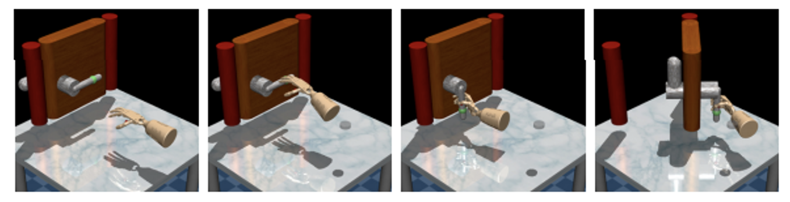

• Undo latch and swing door open

• Task complete when door touches door stopper

• No information of latch explicitly provided

• A lot of hidden sub-tasks

• Position of door is randomized

## Manipulation Task 4

[***Tool Use***]{.underline}

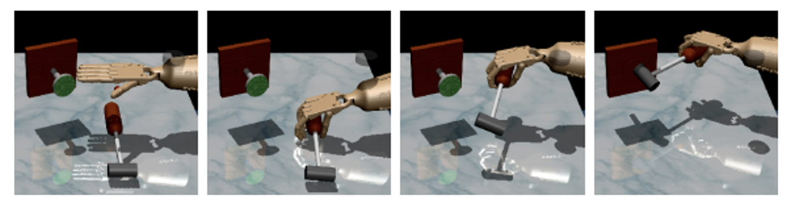

• Pickup and hammer nail

• Task complete when entire nail is inside the board

• Use tool instead of just relocation

• Multiple steps in task

## Experimental Setup

:::::: columns
:::: {.column .small-math width="55%"}
::: {layout="[1,1]"}
[***ADROIT hand***]{.underline} 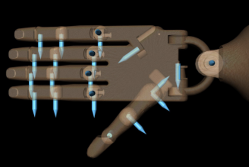

[***HTC headset***]{.underline} 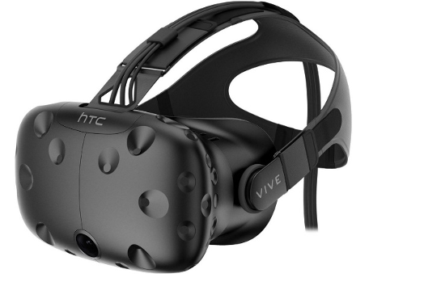
:::

-   24-DOF hand
-   First, middle, ring – 4 DOF each
-   Little finger, thumb – 5 DOF each
-   Wrist – 2 DOF
-   Actuated with position control and has joint angle sensor
-   MuJoCo physics simulation with friction
-   25 demonstrations for each task
::::

::: {.column .small-math width="45%"}
[***HAPTIX Simulator***]{.underline}



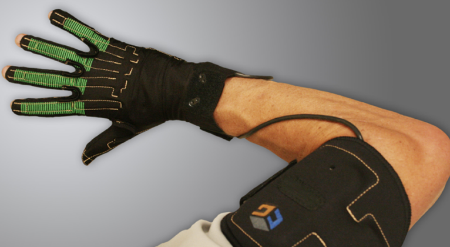\
[***CyberGlove 3***]{.underline}
:::
::::::

## Methodology (Problems with RL)

• Challenges with using RL

|       • RL requires careful reward shaping
|       • Impractical number of samples to learn (approx. 100 hours)
|       • Unnatural movement
|       • Not as robust to environmental variations

 

• Solution

|       • Combine RL with demonstrations
|       • Guide exploration and decrease sample complexity
|       • Robust and natural looking behaviour
|       • Demonstration Augmented Policy Gradient (DAPG)

## Methodology (Pretraining with BC)

• Exploration in PG achieved with stochastic action distribution\
• Poor initialization leads to slow exploration\
• Behavioral Cloning (BC) guides exploration\
• Reduces sample complexity

$$
\text{maximize}_{\theta} \sum_{(s, a) \in \rho_D} \ln \pi_{\theta}(a \mid s)
$$

• Mimic actions taken in demonstrations\
• Does not guarantee effectiveness of policy due to distributional shift

## Methodology (Fine-tuning with augmented loss)

• BC does not make optimal use of demonstrations\
• Cannot learn subtasks (reaching, grasping, hammering)\
• BC policy (only grasping)\
• Capturing all data

$$
g_{\text{aug}} = \sum_{(s,a) \in \rho_{\pi}} \overline{\nabla_{\theta} \ln \pi_{\theta}(a \mid s)} \, A^{\pi}(s, a) + \sum_{(s,a) \in \rho_{D}} \overline{\nabla_{\theta} \ln \pi_{\theta}(a \mid s)} \, w(s, a)
$$

 

$$
w(s, a) = \lambda_0 \lambda_1^k \max_{(s', a') \in \rho_\pi} A^\pi(s', a') \quad \forall (s, a) \in \rho_D
$$

::: {.orange .small-math}
[Policy gradient]{.absolute bottom="360" left="300"}

[Behavioral cloning]{.absolute bottom="360" right="200"}

[$\uparrow$\
Dataset from policy]{.absolute bottom="230" left="235"}

[$\uparrow$\
Dataset from\
demonstrations]{.absolute bottom="210" right="260"}

[$\uparrow$\
Weighting\
function]{.absolute bottom="240" right="70"}

[$\downarrow$ iteration]{.absolute bottom="190" left="400"}

[$\uparrow \quad \uparrow$\
hyperparameters]{.absolute bottom="90" left="350"}
:::

## Methodology (NPG)

 

**Vanilla Policy Gradient:** $g = \frac{1}{NT} \sum_{i=1}^{N} \sum_{t=1}^{T} \nabla_{\theta} \log \pi_{\theta}(a_t^i \mid s_t^i) \hat{A}^{\pi}(s_t^i, a_t^i, t)$

**Fisher Information Matrix:** $F_{\theta} = \frac{1}{NT} \sum_{i=1}^{N} \nabla_{\theta} \log \pi_{\theta}(a_t^i \mid s_t^i) \nabla_{\theta} \log \pi_{\theta}(a_t^i \mid s_t^i)^{T}$

**Natural Policy Gradient:** $\tilde{g} = F_{\theta}^{-1} g$

 

::: {.small-math .arrow-bullets}
▶ Fisher information matrix measures the curvature (sensitivity) of policy relative to model parameters

▶ $\tilde{g}$ is the steepest ascent direction when *distance between policies* is measured by KL divergence, instead of Euclidean distance between parameters:

$$
\tilde{g} \ \propto \ \arg\max_{\Delta\theta}\ g^{\top}\Delta\theta
\quad \text{s.t.} \quad
\underbrace{\tfrac{1}{2}\Delta\theta^{\top} F_{\theta}\, \Delta\theta}_{\approx\ \text{KL}(\pi_\theta \,\|\, \pi_{\theta+\Delta\theta})} \le \tfrac{\delta}{2}
$$

▶ [Consequence: the update is invariant to how the policy is parameterized. Rescaling or reparameterizing $\theta$ changes $g$, but not the policy change $\tilde{g}$ produces.]{.red}
:::

## Fisher Information: Simple Examples

::: r-stack
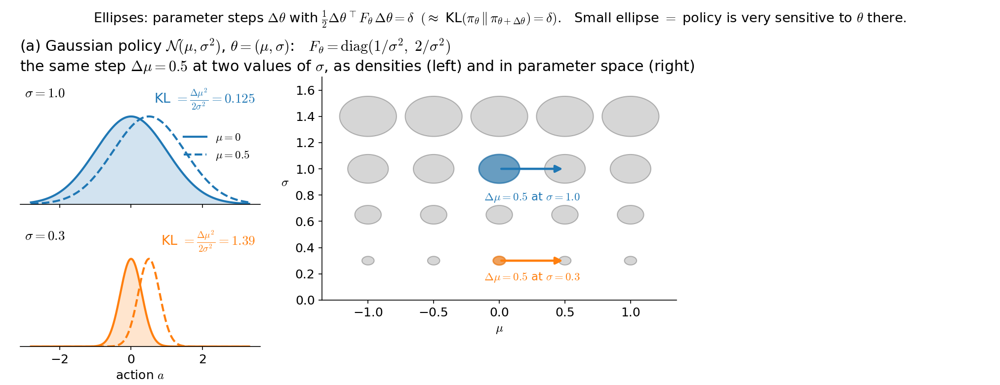{width="100%"}

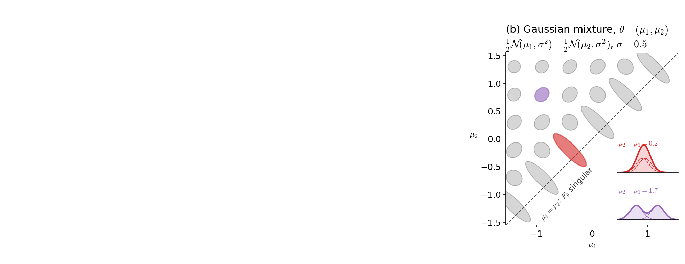{.fragment fragment-index=1 width="100%"}
:::

:::: small-math
• $\frac{1}{2}\Delta\theta^\top F_\theta \Delta\theta$ is the second-order approximation of $\text{KL}(\pi_\theta \,\|\, \pi_{\theta + \Delta\theta})$, i.e. $F_\theta$ is the curvature of the KL divergence

• The same parameter step changes the policy much more where ellipses are small (low-variance Gaussians)

• NPG limits every update to a KL ellipse of fixed size, so steps automatically shrink where the policy is sensitive

::: {.fragment fragment-index=1}
• $F_\theta$ can be singular: pulling identical mixture components apart does not change the distribution to first order, so implementations invert $F_\theta + \lambda I$
:::
::::

## Natural Gradient vs Vanilla Gradient

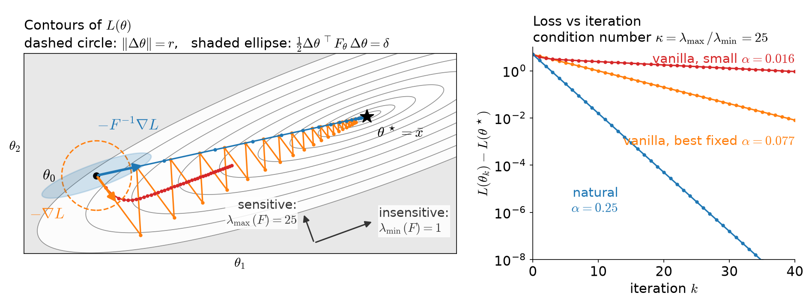{width="100%"}

::::: {.small-math .arrow-bullets}
Max. likelihood fit of $p_\theta(x) = \mathcal{N}(x;\, \theta, \Sigma)$, elongated $\Sigma$:
$\ L(\theta) = \tfrac{1}{2}(\theta - \bar{x})^\top \Sigma^{-1} (\theta - \bar{x})$,
$\ \nabla_\theta L = \Sigma^{-1}(\theta - \bar{x})$,
$\ F_\theta = \Sigma^{-1}$

▶ **Vanilla:** $-\nabla_\theta L$ is perpendicular to the contours. $\alpha > 2/\lambda_{\max}$ diverges along the sensitive direction, so the insensitive one shrinks by at best $\frac{\kappa - 1}{\kappa + 1}$ per step.

▶ **Natural:** $-F_\theta^{-1} \nabla_\theta L = -(\theta - \bar{x})$ points straight at the minimum, and the error shrinks by $(1 - \alpha)$ per step for any $\kappa$.

::: fragment
▶ [Here $F_\theta$ happens to equal the Hessian of $L$, so this is Newton's method. In general $F_\theta$ is the curvature of the KL, not of $L$. It is always positive semi-definite and only needs first derivatives of $\log p_\theta$.]{.red}
:::
:::::

## Natural Policy Gradient vs Policy Gradient: Simple Example

::::: {.small-math .arrow-bullets}
▶ Take a Gaussian policy $\pi_\theta(a) = \mathcal{N}(a;\, \mu, \sigma^2)$ with $\theta = (\mu, \sigma)$, and a loss that only cares about the mean:

$$
L(\theta) = \tfrac{1}{2}(\mu - \mu^\star)^2,
\qquad
\nabla_\theta L = \begin{pmatrix} \mu - \mu^\star \\ 0 \end{pmatrix},
\qquad
F_\theta = \begin{pmatrix} 1/\sigma^2 & 0 \\ 0 & 2/\sigma^2 \end{pmatrix}
$$

▶ The two updates, $\theta \leftarrow \theta - \alpha\, \nabla_\theta L$ versus $\theta \leftarrow \theta - \alpha\, F^{-1}_\theta \nabla_\theta L$, move the mean by

$$
\Delta\mu_{\text{vanilla}} = -\alpha\,(\mu - \mu^\star)
\qquad\text{vs.}\qquad
\Delta\mu_{\text{natural}} = -\alpha\,\boxed{\sigma^2}\,(\mu - \mu^\star)
$$

::: fragment
▶ [The vanilla step is the same size no matter how deterministic the policy already is.]{.red} For policies with $\sigma \to 0$ a fixed shift of $\mu$ is an enormous change in the distribution  ($\text{KL} \approx \Delta\mu^2 / 2\sigma^2 \to \infty$) and this is exactly when vanilla PG overshoots and collapses a nearly-converged policy.

▶ The natural gradient scales by $\sigma^2$ and so keeps every step at a **constant KL**, automatically braking as the policy sharpens.
:::

::: fragment
▶ Now reparameterize with $\mu = c\,u$, i.e. just a change of units for the same policy class. Then $\nabla_u L = c\,(\mu - \mu^\star)$ and $F_{uu} = c^2/\sigma^2$, so the *same* step $\alpha$ moves the mean by

$$
\Delta\mu_{\text{vanilla}} = -\alpha\, c^2 (\mu - \mu^\star)
\qquad\text{vs.}\qquad
\Delta\mu_{\text{natural}} = -\alpha\, \sigma^2 (\mu - \mu^\star)
$$

▶ [Vanilla gradient descent follows a different trajectory for every choice of $c$; the natural gradient follows the same one. The $c^2$ cancels because $F$ transforms the same way the gradient does.]{.red}
:::
:::::

## Results 1

[Reinforcement learning from scratch]{.underline}

• Can RL cope with high dimensional manipulation tasks ?\
• Is it robust to variations in environment ?\
• Are movements safe and can they be used on real hardware ?

 

• Compare NPG vs DDPG (Deep Deterministic Policy Gradient)\
• DDPG is a policy gradient actor-critic algorithm that is off-policy\
• Stochastic policy for exploration, estimates deterministic policy\
• Score based on percentage of successful trajectories (100 samples)\
• Sparse Reward vs Reward shaping

## Results 1

[Reinforcement learning from scratch]{.underline}

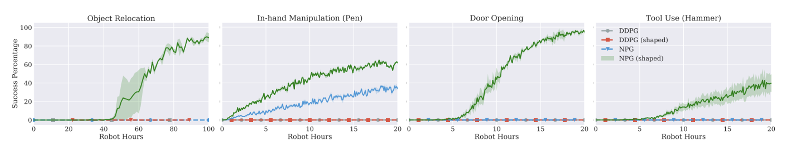

• NPG learns with reward shaping, DDPG fails to learn\
• DDPG is sample efficient but sensitive to hyper-parameters\
• Resulting policies have unnatural behaviors\
• Poor sample efficiency, can't use on hardware\
• Cannot generalize to unseen environment (weight and ball size change)

## Results 2

[Reinforcement learning with demonstrations]{.underline}

• Does incorporating demonstrations reduce learning time?\
• Comparison of DAPG vs DDPGfD (fD = from demonstrations)\
• Does it result in human like behaviour ?

 

• DDPGfD better version of DDPG (demonstrations in replay buffer, prioritized experience replay, n-step returns, regularization)\
• Only use sparse rewards

## Results 2

[Reinforcement learning with demonstrations]{.underline}

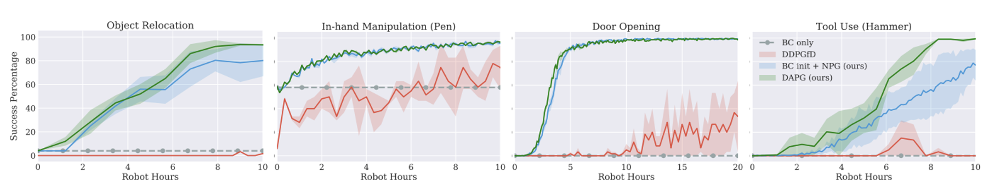

::::: columns
::: {.column width="50%"}
• DAPG outperforms DDPGfD\
• DAPG requires few robot hours\
• Can be used on real hardware\
• Robust and human behavior\
• Generalizes to unseen environment
:::

::: {.column width="50%"}
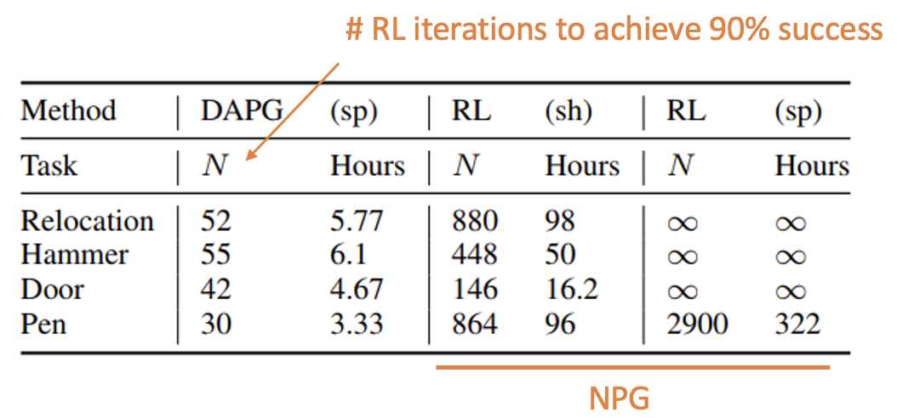
:::
:::::

## Left for Future Work

• Tests on real hardware

• Reduce sample complexity using novelty based exploration methods

• Learn policies from raw visual inputs and tactile sensing

## Today’s agenda

::: grey-text
• Guided policy search (GPS)

• Expert iteration & learning to search

• Blending MPC and value function approximation (MPQ($\lambda$))

• Imitating motion capture with RL (DeepMimic)

• Combining behavioral cloning and RL
:::

• Dynamic movement primitives (DMPs)

::: aside
Acknowledgments\
Today’s slides are based on student presentations from 2019 by: Yuwei Chen, Jienan Yao, and Jason Rebello as well as from YouTube recordings of lectures from Gregor Schöner, for his Autonomous Robotics course:\
<https://www.youtube.com/watch?v=IV8Eze9Hxrc&ab_channel=Dynamicfieldtheory>
:::

## 



[<https://www.youtube.com/watch?v=IV8Eze9Hxrc>]{.tiny-font}

## Dynamic Movement Primitives

::::: {.small-math .arrow-bullets}
▶ Idea: instead of storing a demonstrated movement as a time-indexed trajectory $y^\star(t)$ and tracking it, encode it as a **dynamical system with a built-in attractor at the goal $g$**. Each degree of freedom $y$ (a joint angle, or one coordinate of the end-effector) gets its own *transformation system*:

$$
\tau \dot z = \underbrace{\alpha_z\big(\beta_z (g - y) - z\big)}_{\text{spring-damper pulling } y \text{ to } g} + \underbrace{f(x)}_{\text{learned forcing term}},
\qquad
\tau \dot y = z
$$

▶ With $f = 0$ this is a linear spring-damper, i.e. a PD controller towards $g$. Choosing $\beta_z = \alpha_z / 4$ makes it critically damped, so $(y, \dot y) = (g, 0)$ is a globally asymptotically stable fixed point: $y$ converges to $g$ from any initial state, without oscillating.

▶ The forcing term $f$ shapes *how* the system gets to $g$, i.e. the path of the demonstration. It depends on a phase variable $x$ instead of time and is designed to vanish as the movement ends, [so the attractor at $g$ is preserved for *any* learned weights.]{.red}

::: fragment
▶ Compared to tracking $y^\star(t)$ we get for free: robustness to perturbations (the state evolves from wherever it was pushed to, no replanning), a new goal $g$ or duration $\tau$ is just a change of parameters, and a compact parameterization (tens of weights per DoF) that is easy to learn from one demonstration and to refine with RL.
:::
:::::

::: tiny-font
Dynamical Movement Primitives: Learning Attractor Models for Motor Behaviors. Ijspeert, Nakanishi, Hoffmann, Pastor, Schaal. Neural Computation'13. <https://ieeexplore.ieee.org/document/6797340>
:::

## DMPs: Canonical System and Forcing Term

::::: {.small-math .arrow-bullets}
$$
\underbrace{\tau \dot x = -\alpha_x x, \quad x(0) = 1}_{\text{canonical system}}
\qquad\qquad
f(x) = \frac{\sum_{i=1}^{N} \psi_i(x)\, w_i}{\sum_{i=1}^{N} \psi_i(x)}\; x\,(g - y_0),
\qquad
\psi_i(x) = \exp\!\big(-h_i (x - c_i)^2\big)
$$

▶ The phase $x$ decays from 1 to 0 and acts as a clock that replaces explicit time. [All DoFs of a movement share the same canonical system]{.red}, which keeps them synchronized: multi-DoF coordination comes from the shared phase, not from coupling the transformation systems to each other.

▶ $\psi_i$ are Gaussian basis functions in $x$, with centers $c_i$ spaced so that they are evenly spread in time. Their normalized weighted sum is a function approximator that is **linear in the weights $w_i$**.

▶ Multiplying by $x$ makes $f \to 0$ as $x \to 0$, so eventually only the spring-damper remains and $y \to g$. Multiplying by $(g - y_0)$ makes the movement scale with its amplitude.

▶ No term depends on $t$ directly, so the DMP is an autonomous system in the state $(y, z, x)$, i.e. a policy $\ddot y = \pi(y, \dot y, x;\, w, g, \tau)$. On a robot, its outputs $(y, \dot y, \ddot y)$ are the desired states for a low-level tracking controller (e.g. inverse dynamics + PD).

::: fragment
▶ **Rhythmic DMPs** (drumming, walking, wiping): replace the canonical system by a phase oscillator $\tau \dot\phi = 1$, use periodic basis functions $\psi_i = \exp\big(h_i(\cos(\phi - c_i) - 1)\big)$ and scale $f$ by an amplitude $r$ instead of $x(g - y_0)$. The goal $g$ becomes the center of the oscillation, and the point attractor becomes a limit cycle.
:::
:::::

## Learning a DMP from a Single Demonstration

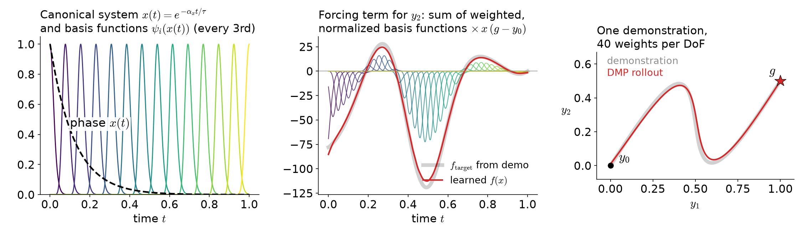{width="90%"}

::::: {.small-math .arrow-bullets}
▶ Given a demonstration $y_{\text{demo}}(t)$, $t \in [0, T]$, set $y_0 = y_{\text{demo}}(0)$, $g = y_{\text{demo}}(T)$, $\tau = T$, and differentiate numerically to get $\dot y_{\text{demo}}, \ddot y_{\text{demo}}$. Solving the transformation system for $f$ gives the forcing term that reproduces the demo exactly:

$$
f_{\text{target}}(t) = \tau^2 \ddot y_{\text{demo}} - \alpha_z\big(\beta_z (g - y_{\text{demo}}) - \tau \dot y_{\text{demo}}\big)
$$

▶ Since $f$ is linear in $w$, fitting it is locally weighted linear regression, with one closed-form solve per basis function:

$$
w_i = \frac{s^\top \Gamma_i\, f_{\text{target}}}{s^\top \Gamma_i\, s},
\qquad
s = \begin{pmatrix} x_1 (g - y_0) \\ \vdots \\ x_T (g - y_0) \end{pmatrix},
\qquad
\Gamma_i = \operatorname{diag}\big(\psi_i(x_1), \ldots, \psi_i(x_T)\big)
$$

▶ [Imitation becomes supervised regression of $f$, and the dynamics, not the accuracy of the regression, guarantee that the rollout reaches $g$.]{.red} No iterative optimization, no rollouts, one demonstration.
:::::

## DMPs Generalize by Construction

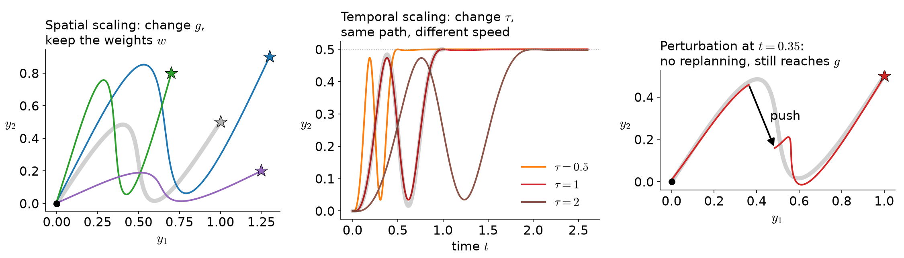{width="100%"}

::::: {.small-math .arrow-bullets}
▶ **New goal** (left): keep $w$, change $g$. Because $f \propto (g - y_0)$, each DoF is rescaled by $(g - y_0) / (g_{\text{demo}} - y_{0,\text{demo}})$. The shape is preserved up to a per-axis stretch, which distorts it when the axes are scaled very differently (green).

▶ **New duration** (middle): $\tau$ rescales time in both the canonical and the transformation system, so the rollout traces the same path at a different speed.

▶ **Perturbations** (right): the DMP is a policy of its current state, so after the push it continues from where it is and still converges to $g$.

::: fragment
▶ **Coupling terms** add online feedback. *Phase stopping*: $\tau \dot x = -\alpha_x x \,/\, \big(1 + \alpha_c \|\tilde y - y\|^2\big)$ slows down the clock when the actual robot position $\tilde y$ lags behind the DMP state $y$, e.g. when the arm is blocked. *Obstacle avoidance*: add a term $C_t(y, \dot y, o)$ to $\tau \dot z$ that steers the movement away from an obstacle at $o$.
:::
:::::

::: tiny-font
Biologically-inspired dynamical systems for movement generation: automatic real-time goal adaptation and obstacle avoidance. Hoffmann, Pastor, Park, Schaal. ICRA'09.\
Learning and generalization of motor skills by learning from demonstration. Pastor, Hoffmann, Asfour, Schaal. ICRA'09.
:::

## DMPs as Policies for RL, and Their Limitations

::::: columns
::: {.column .small-math .arrow-bullets width="48%"}
[DMPs as a policy class for RL]{.underline}

▶ The weights $w$ (and optionally $g$, $\tau$) form a low-dimensional, smooth and stable policy parameterization $\theta$. Every sample of $\theta$ is a goal-reaching movement, so exploring by perturbing parameters per episode, $\theta + \epsilon$, is feasible on real hardware.

▶ Same recipe as DAPG earlier today: [initialize from a demonstration, then improve with RL.]{.red}

▶ Episodic natural actor-critic on DMPs (Peters & Schaal '08), i.e. the natural gradient from earlier today. PoWER (Kober & Peters '09) learns ball-in-a-cup on a real arm in under 100 trials. PI$^2$ (Theodorou et al. '10).
:::

::: {.column width="4%"}
:::

::: {.column .small-math .arrow-bullets .fragment width="48%"}
[Limitations]{.underline}

▶ One DMP encodes one movement from one demonstration. It does not capture the variability across several demos (→ Probabilistic Movement Primitives).

▶ Perception only enters through $g$, $\tau$ and hand-designed coupling terms, so it is not a visuomotor policy (→ predict $w, g$ from images, e.g. Neural Dynamic Policies).

▶ Per-DoF scaling by $(g - y_0)$: if $g \approx y_0$ in some DoF the forcing term vanishes and the shape is lost, and if the sign flips the movement is mirrored. It is also not invariant to rotating the task (→ reformulation of Pastor et al. '09).

▶ Multi-step tasks need a library of primitives plus a way to select and sequence them.
:::
:::::

::: tiny-font
Reinforcement Learning of Motor Skills with Policy Gradients. Peters, Schaal. Neural Networks'08.\
Policy Search for Motor Primitives in Robotics. Kober, Peters. NeurIPS'08.\
A Generalized Path Integral Control Approach to Reinforcement Learning. Theodorou, Buchli, Schaal. JMLR'10.\
Probabilistic Movement Primitives. Paraschos, Daniel, Peters, Neumann. NeurIPS'13.\
Neural Dynamic Policies for End-to-End Sensorimotor Learning. Bahl, Mukadam, Gupta, Pathak. NeurIPS'20.
:::
