## Today’s agenda

• Learning programs based on execution traces (NPI - Neural Programmer Interpreters)

• Extending NPI for video-based robot imitation (NTP - Neural Task Programming)

• Inferring sub-task boundaries (TACO - Temporal Alignment for Control)

• Learning to search in Task and Motion Planning (TAMP)

• Generalization through imitation – using hierarchical policies

• Compositional generalization in diffusion planning

## Neural Programmer-Interpreters {.center}

By Scott Reed & Nando de Freitas

## Motivation

Neural Programmer-Interpreters (NPI) is an attempt to use **neural methods** to train machines to carry out simple tasks based on a **small amount of training data**.

## Recurrent neural network (RNN)

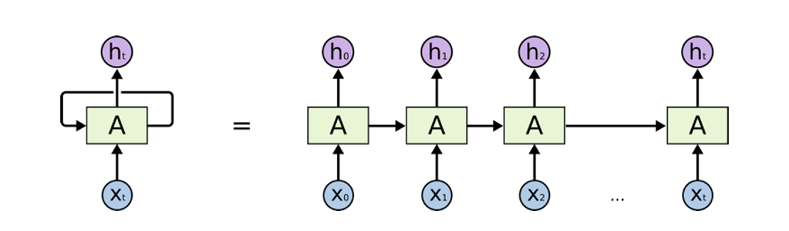

• RNN is a neural network with feedback

• Hidden state is to capture history information and current state of the network

## Long Short Term Memory (LSTM)

::::: columns
::: {.column width="50%"}
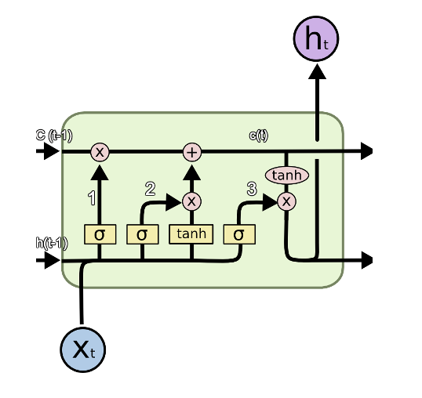
:::

::: {.column width="50%"}
  

• LSTM is a special kind of RNN

• Gates are used to control information flow. Just like a valve
:::
:::::

## Model

The NPI core is a LSTM network that learns to represent and execute programs given their execution traces

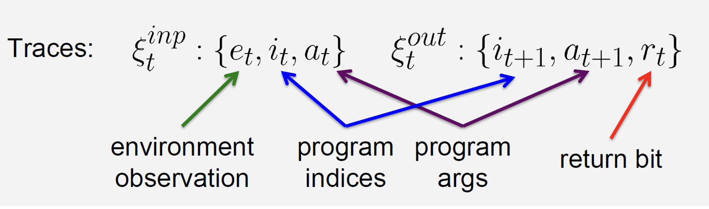

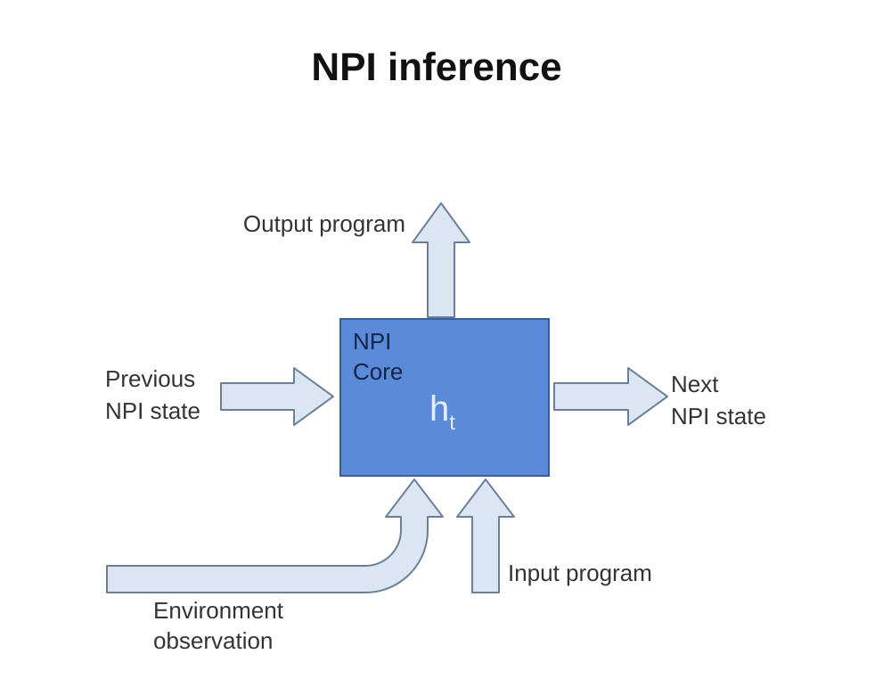

## Algorithm - inference

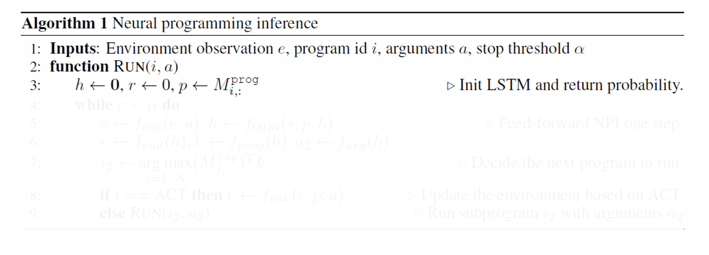

[Line 3]{.red}: $𝑀^{𝑝𝑟𝑜𝑔}$ and $𝑀^{𝑘𝑒𝑦}$ are memory banks to store program embeddings and program keys

## Algorithm - inference

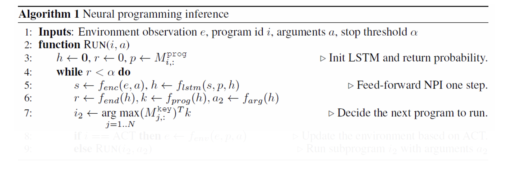

[Line 7]{.red}: $(𝑀_{𝑗,}^{𝑘𝑒𝑦})^{𝑇}𝑘$ is directly measurement for cosine similarity

## Algorithm - inference

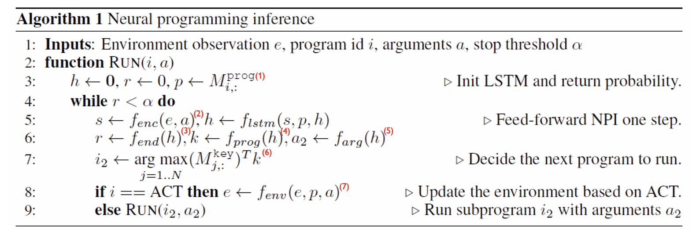

::: small-math
[(1)]{.red}: $𝑀^{𝑝𝑟𝑜𝑔}$ and $𝑀^{𝑘𝑒𝑦}$ are memory storing program embeddings and program keys

[(2)]{.red}: $𝑓_{𝑒𝑛𝑐}$ is a domain-specific encoder (for different tasks, have different encoders)

[(3)]{.red}: $𝑓_{𝑒𝑛𝑑}$ is to calculate the probability of finishing the program

[(4)]{.red}: $𝑓_{𝑝𝑟𝑜𝑔}$ is to retrieve the next program key from memory

[(5)]{.red}: $𝑓_{𝑎𝑟𝑔}$ is to return the next program’s arguments

[(6)]{.red}: $(𝑀_{𝑗,}^{𝑘𝑒𝑦})^{𝑇}𝑘$ is to measure cosine similarity

[(7)]{.red}: $𝑓_{env}$ is a domain-specific transition mapping
:::

## Training

Directly maximize the probability of the correct execution trace output $𝞷^{𝑜𝑢𝑡}$ conditioned on $𝞷^{𝑖𝑛𝑝}$:

$$
𝜃^∗ = 𝑎𝑟𝑔 \underset{𝜃}{max} \sum_{(𝞷^{𝑖𝑛𝑝}, 𝞷^{𝑜𝑢𝑡})} 𝑙𝑜𝑔𝑃(𝞷^{𝑜𝑢𝑡}|𝞷^{𝑖𝑛𝑝}, 𝜃)
$$

Then we can just run gradient ascent to optimize it

## Tasks

• Addition: [Teach the model the standard grade school algorithm of adding 2 base-10 numbers]{.small-math}

• Sorting: [Teach the model bubble sorting to sort an array of numbers in ascending order]{.small-math}

• Canonicalizing 3D models: [Teach the model to generate a trajectory of actions that delivers the camera to the target view, e.g, frontal pose at a 15° elevation]{.small-math}

## Adding numbers together

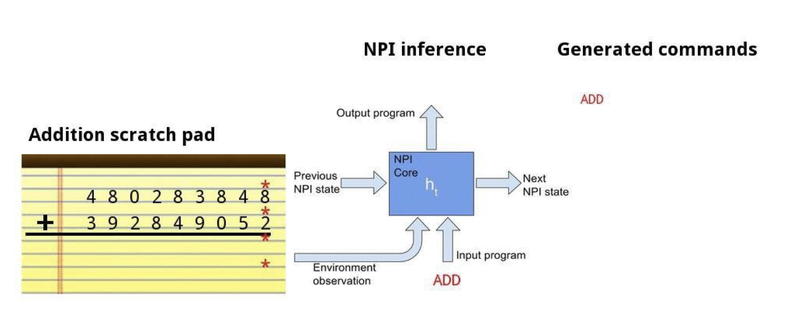

## Addition demo

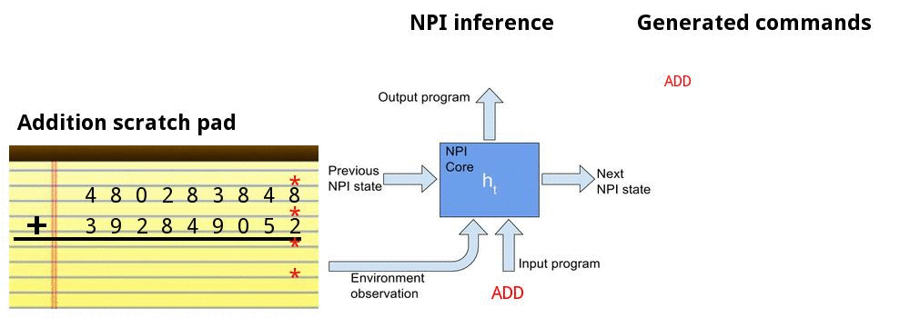

## Bubble sort

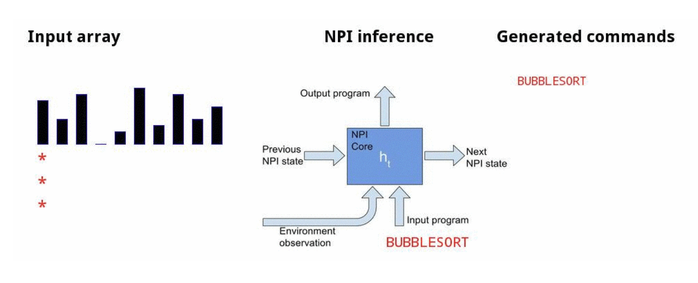

## Sorting demo

## Canonicalizing 3D models

## Canonicalizing demo

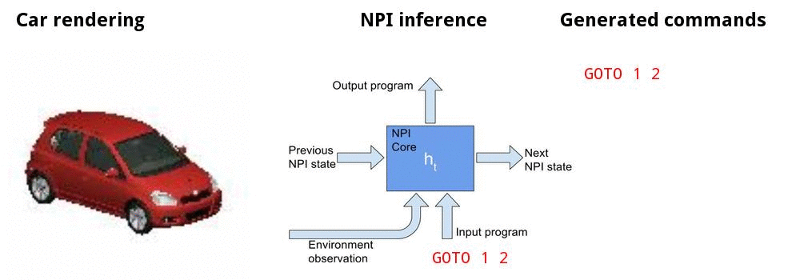

## Experiments

 

• Data Efficiency

• Generalization

• Learning new programs with a fixed NPI cores

## Data Efficiency - Sorting

 

::::: columns
::: {.column width="70%"}
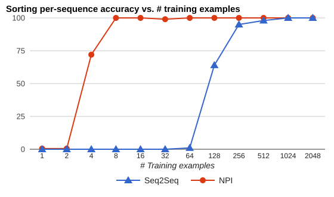
:::

::: {.column width="30%"}
• Seq2Seq LSTM and NPI used the same number of layers and hidden units.

• Trained on length up to 20 arrays of single-digit numbers.

• NPI benefits from mining multiple subprogram examples per sorting instance, and additional parameters of the program memory.
:::
:::::

## Generalization - Sorting

 

::::: columns
::: {.column width="70%"}
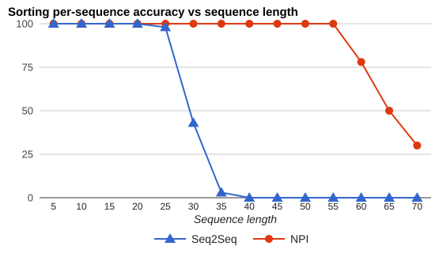
:::

::: {.column width="30%"}
• For each length **up to 20**, they provided 64 example bubble sort traces, for a total of 1216 examples.

• Then, they evaluated whether the network can learn to sort arrays beyond length 20
:::
:::::

## Generalization - Adding

 

::::: columns
::: {.column width="70%"}
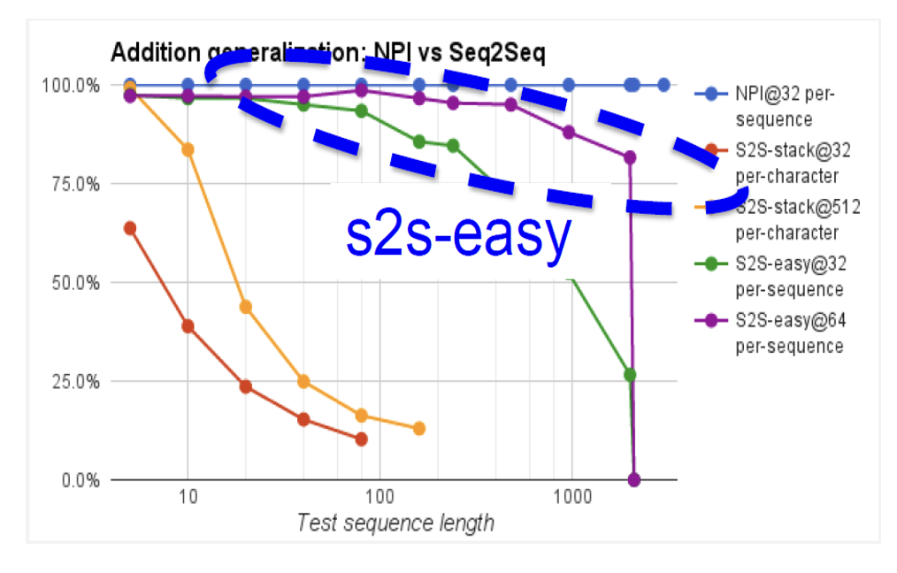
:::

::: {.column width="30%"}
• NPI trained on **32 examples** for sequence **length up to 20**

• s2s-easy trained on **twice** as many examples as NPI (purple curve)

• s2s-stack trained on **16 times** more examples than NPI (orange curve)
:::
:::::

## Generalization - Adding

 

::::: columns
::: {.column width="70%"}
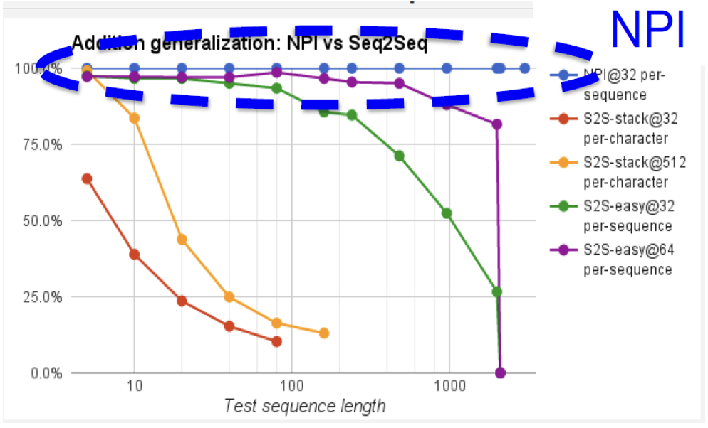
:::

::: {.column width="30%"}
• NPI trained on **32 examples** for sequence **length up to 20**

• s2s-easy trained on **twice** as many examples as NPI (purple curve)

• s2s-stack trained on **16 times** more examples than NPI (orange curve)
:::
:::::

## Learning New Programs with a Fixed NPI Core

• Toy example: maximum-finding in an array

• Simple (not optimal) way: call BUBBLESORT and then take the right-most element of the array. Two new programs:

• **RJMP**: Move all pointers to the rightmost position in the array by repeatedly calling RSHIFT program

• **MAX**: Call BUBBLESORT and then RJMP

• Expand program memory by adding 2 slots. Then learn by backpropagation with the NPI core and all other parameters fixed.

## Learning New Programs with a Fixed NPI Core

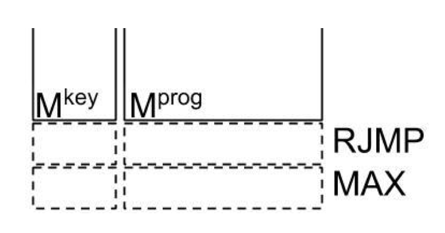{fig-align="center" height="240"}

::: {.red-annotation .absolute right="0" bottom="50%"}
Only the memory slots of\
the new program are updated!\
All other weights are\
fixed!
:::

Protocol:

• Randomly initialize new program vectors in memory

• Freeze core and other program vectors

• Backpropagate gradients to new program vectors

## Quantitative Results

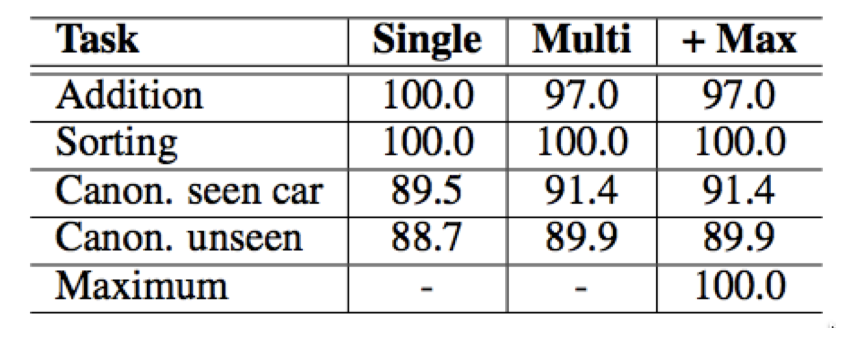{fig-align="center" height="240"}

• Numbers are per-sequence % accuracy

• + Max: indicates performance after addition of MAX program to memory

• “unseen” uses a test set with disjoint car models from the training set

## [Followup work: AlphaNPI (training NPI without execution traces)]{.medium}

::::: columns
::: {.column width="50%"}
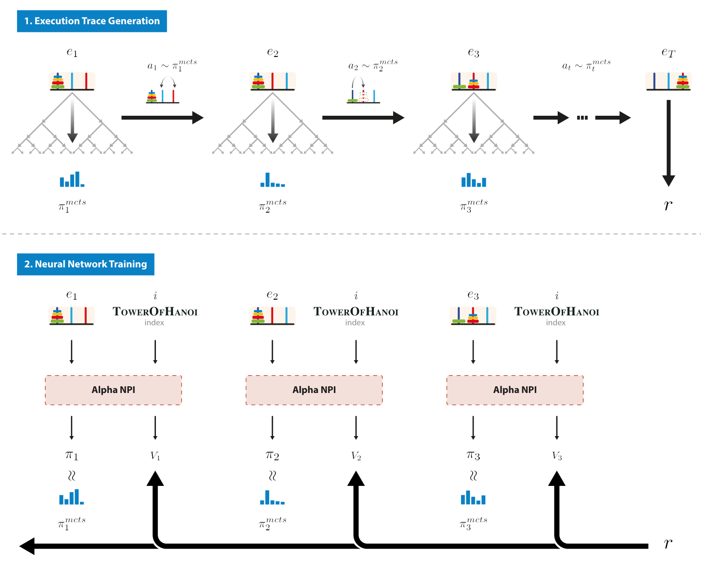{width="100%"}
:::

::: {.column .medium width="50%"}
-   NPI needs full execution traces. AlphaNPI only needs a [specification]{.red}: a hierarchy of programs, each with pre- and post-conditions

-   Sparse reward: 1 if the post-conditions hold when the program calls STOP, 0 otherwise

-   NPI becomes an actor-critic (policy $\pi$, value $V$), trained as in AlphaZero: MCTS gives an improved policy $\pi^{mcts}$, and the loss is $-\pi^{mcts\top} \log \pi + (V - r)^2$

-   [Recursive MCTS]{.red}: calling a learned program builds a new search tree for it

-   Recursive bubble sort trained on lists of length ≤ 4: 100% on length 100 with MCTS, 10% with the network alone. Tower of Hanoi trained on 2 disks: 100% on 12 disks
:::
:::::

[Learning Compositional Neural Programs with Recursive Tree Search and Planning, Pierrot et al, NeurIPS 2019. <https://arxiv.org/abs/1905.12941>]{.tiny-font}

## Today’s agenda

::: grey-text
• Learning programs based on execution traces (NPI - Neural Programmer Interpreters)
:::

• Extending NPI for video-based robot imitation (NTP - Neural Task Programming)

• Inferring sub-task boundaries (TACO - Temporal Alignment for Control)

• Learning to search in Task and Motion Planning (TAMP)

• Generalization through imitation – using hierarchical policies

• Compositional generalization in diffusion planning

## Neural Task Programming: Learning to Generalize Across Hierarchical Tasks {.center}

Danfei Xu, Suraj Nair, Yuke Zhu, Julian Gao, Animesh Garg, Li Fei-Fei, Silvio Savarese

## How the algorithm works

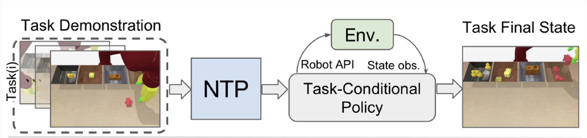

-   Task Demonstration: state trajectory, first/third-person video demonstrations, or a list of language instructions.
-   Task-Conditional Policy: a neural program.
-   Using callable primitive actions to interact with the environment.

## How the algorithm works

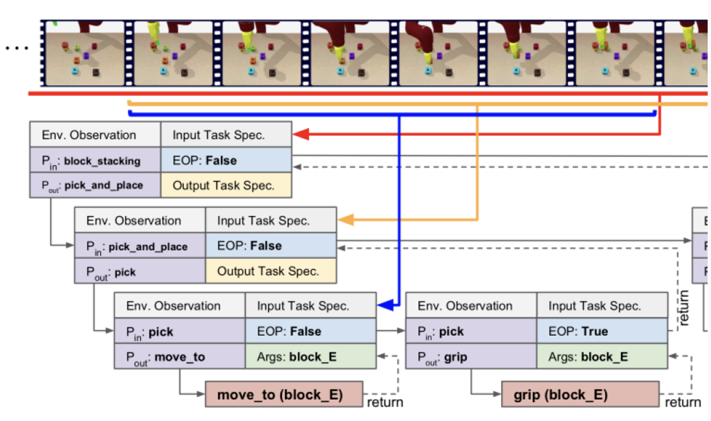{fig-align="center"}

Top-level program block_stacking is recursively decomposed to bottom-level API move_to and grip.

## Goals

Learning to Generalize Across Hierarchical Tasks

-   Generalizing the learned policies to new task objectives
    -   Task Length: more objects to transport
    -   Task Semantics: a different goal
    -   Task Topology: a different trajectory to the same goal
-   Hierarchical composition of primitive actions
    -   Modularization and reusability
    -   Learn the latent structure in complex tasks, instead of fake dependencies

## Implementation: Neural Task Programming

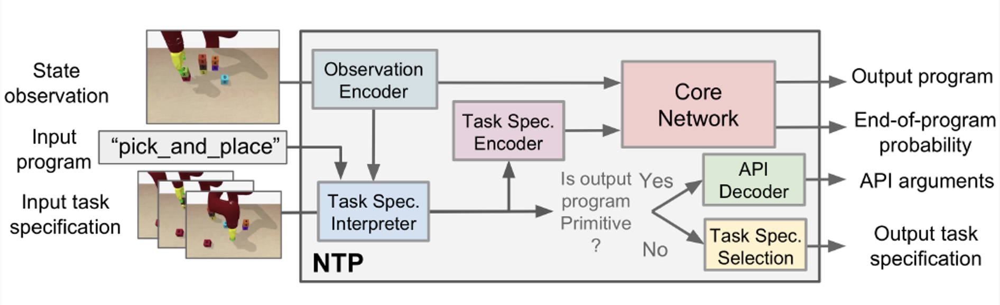{fig-align="center"}

-   Observation Encoder: observation $o_i \Rightarrow$ state representation $s_i$
-   Task Spec. Interpreter: $\Rightarrow$ API arguments $a_i$ or task spec. $\psi_{i+1}$
-   Task Spec. Encoder: task spec. $\psi_i \Rightarrow$ vector space $\phi_i$
-   Core Network: $s_i, P_i, \phi_i \Rightarrow P_{i+1}, r_i$

## Implementation: Extending NPI

Neural Task Programming combines the idea of **Few-Shot Learning from Demonstration** and **Neural Programmer-Interpreters**.

-   Similarities when executing a program:
    -   When the EOP probability exceeds a threshold $\alpha$, control is returned to the caller program;
    -   When the program is not primitive, a sub-program with its arguments is called;
    -   When the program is primitive, a low-level basic action is performed.
-   Two similar modules:
    -   Domain-specific task encoders that map an observation to a state representation.
    -   A key-value memory that stores and retrieves program embeddings.

## Implementation: NTP vs NPI

-   **NPI**: one-shot generalization to tasks with longer lengths; can't generalizing to novel programs without training.
-   **NTP**: generalizes to sub-task permutations (topology) and success conditions (semantics).
-   Three main **differences** of NTP than the original NPI:
    -   NTP can interpret task specifications and perform hierarchical decomposition and thus can be considered as a **meta-policy**;
    -   It uses robot **APl**s as the primitive actions to scale up neural programs for complex tasks;
    -   It uses a **reactive core network** instead of a **recurrent network**, making the model less history-dependent, enabling feedback control for recovery from failures.

## Model Training

-   The model is trained using rich supervision from program execution traces $\{\xi_t| \xi_t = (\Psi_t, p_t, s_t), t = 1 \ldots T\}$.

-   The training objective is to maximize the probability of the correct executions over all the tasks in the dataset $D = \{(\xi_t, \xi_{t+1})\}$.

-   For each task specification, the ground-truth hierarchical decomposition is provided by the expert policy, which is an agent with hard-coded rules.

## Experiments: Setup

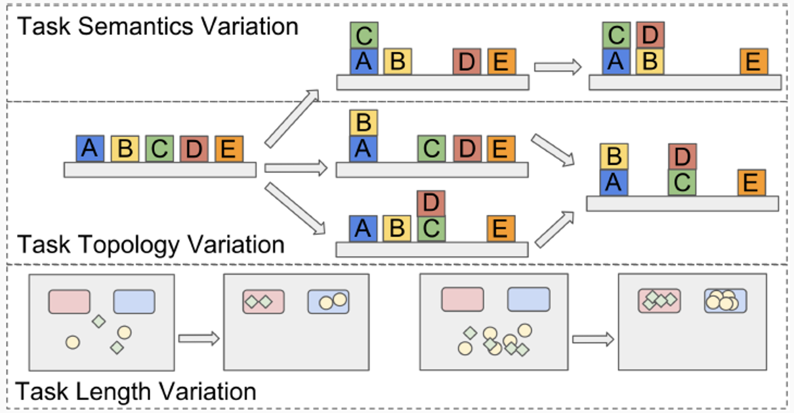{fig-align="center"}

-   Generalization in 3 variations: semantics, topology, and length.
-   Using image-based input without access to ground truth state.
-   Working in real-world tasks combine these variations.

→ Three tasks: Object Sorting, Block Stacking, and Table Clean-up

## Experiments: Object Sorting

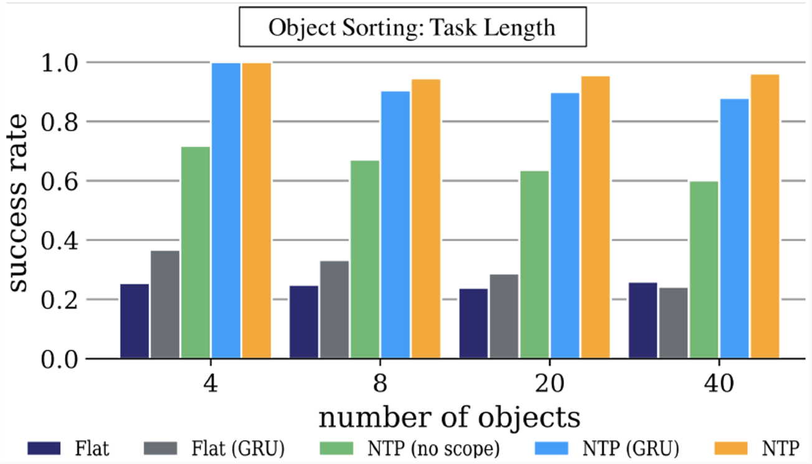{fig-align="center"}

-   **Flat**: non-hierarchical model, directly predicts the primitive APls instead of calling hierarchical programs.

-   **GRU**: Gated Recurrent Unit.

## Experiments: Block Stacking

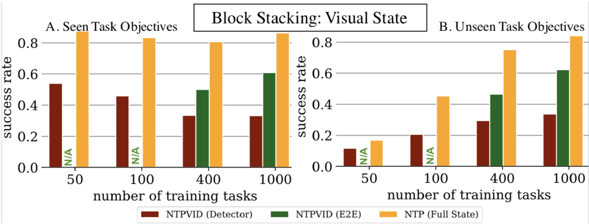{fig-align="center"}

-   **NTPVID(E2E)**: Trained with only visual information.
-   **NTP(Full State)**: Trained with ground-truth hierarchical decomposition.

## Experiments: Table Clean-up

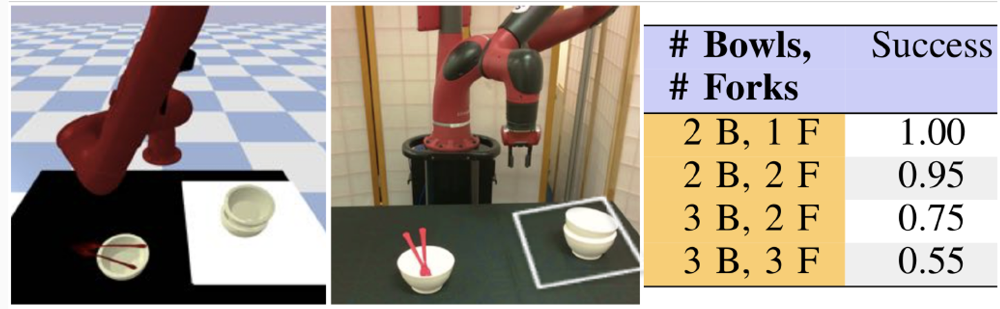{fig-align="center"}

-   Sort plastic bowls and forks into a stack, so they can be steadily carried away.

-   Task variations:

    -   Task length: number of bowls and forks varies.
    -   Task topology: the ordering in which bowls are stacked varies.

## Discussion & Future Work

-   **Neural Task Programming**:
    -   Learns modular and reusable neural programs for hierarchical tasks.
    -   Generalizes with respect to task length, semantics, and topology for complex tasks.
-   **Future work**:
    -   Improve the state encoder to extract more task-salient information such as object relationships;
    -   Devise a richer set of APls such as velocity and torque-based controllers;
    -   Extend this framework to tackle more complex tasks on real robots.

## 

<!--  -->

<iframe data-external="1" src="https://www.youtube.com/embed/YWkBRPnGUqA?rel=0&amp;enablejsapi=1" width="100%" height="80%">

</iframe>

[<https://www.youtube.com/watch?v=YWkBRPnGUqA>]{.tiny-font}

## Questions? {.center}

## Today’s agenda

::: grey-text
• Learning programs based on execution traces (NPI - Neural Programmer Interpreters)

• Extending NPI for video-based robot imitation (NTP - Neural Task Programming)
:::

• Inferring sub-task boundaries (TACO - Temporal Alignment for Control)

• Learning to search in Task and Motion Planning (TAMP)

• Generalization through imitation – using hierarchical policies

• Compositional generalization in diffusion planning

## TACO: Learning Task Decomposition via Temporal Alignment for Control {.center}

Kyriacos Shiarlis, Markus Wulfmeier, Sasha Salter, Shimon Whiteson, Ingmar Posner

## Motivation – Block Stacking Task

::::: columns
::: {.column width="50%"}
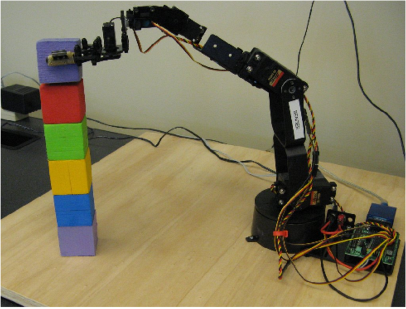
:::

::: {.column width="50%"}
 

-   Complex tasks can often be broken down into simpler sub-tasks

-   Most Learning from Demonstration (LfD) algorithms can only learn a single policy for the whole task

-   Resulting in more complex policies, and also less reusable
:::
:::::

## Modular LfD

 

-   Modelling the task as a composition of sub-tasks

-   Reusable sub-policies (modules) are learned for each sub-task.

-   Sub-policies are easier to learn and can be composed in different ways to execute new tasks.

Key approach: provide the learner with additional information about the demonstration

## TACO: Temporal Alignment for Control

-   Partly supervised
-   Domain agnostic
-   Demonstration is augmented by [task sketches: a sequence of sub-tasks that occur within the demonstration]{.red}

$$
\tau = (b_1, b_2, . . . , b_L),
$$

-   Simultaneously aligns the sketches with the observed demonstrations and learns the required sub-policies

## Example: Block stacking task

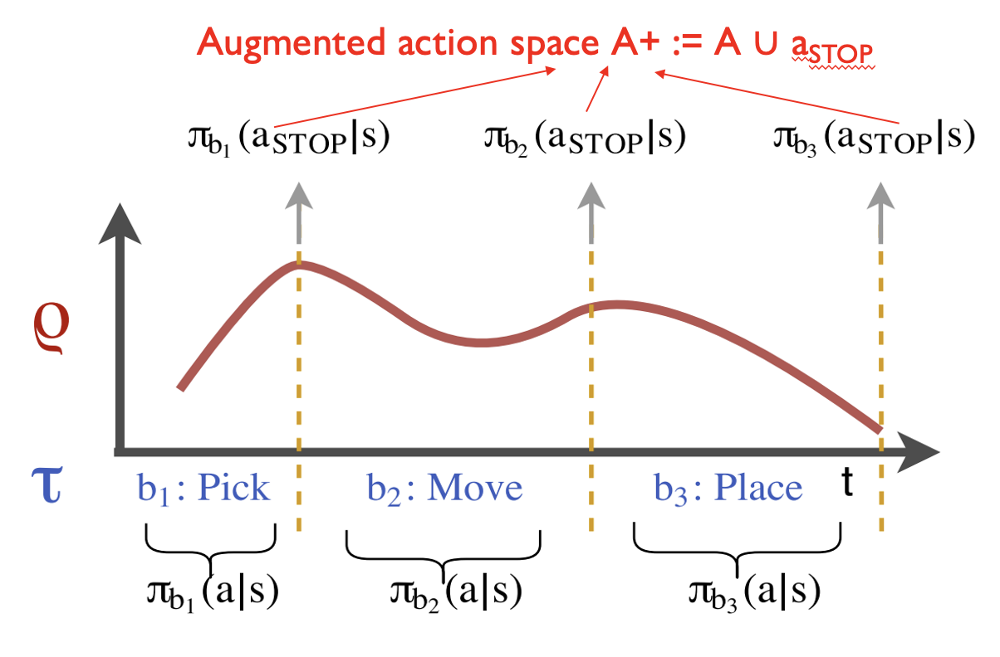{fig-align="center"}

## Problem

 

How do we align task-sketches with the demonstration?

Main idea: Borrow temporal sequence alignment techniques from speech recognition

## TACO: Temporal Alignment for Control

::::: columns
::: {.column width="60%"}
 

- Input trajectory $\rho=((s_1,a_1),...,(s_T,a_T))$

- Task sketch $\tau = (b_1, b_2, . . . , b_L)$ indicating which sub-tasks are active in $\rho$. Assume $L \ll T$

- A path $\zeta = (\zeta_1, \zeta_2, ..., \zeta_T )$ is a sequence of sub-tasks of the same length as the input sequence $\rho$, describing the active sub-task $\zeta_t$ at every time-step

- $Z_{T,\tau}$ is the set of all possible paths $\zeta$ of length T, given a task sketch $\tau$

- Eg. T = 6, $\tau = (b_1, b_2, b_3), \zeta = (b_1, b_1, b_2, b_3, b_3, b_3)$
:::

::: {.column width="40%"}
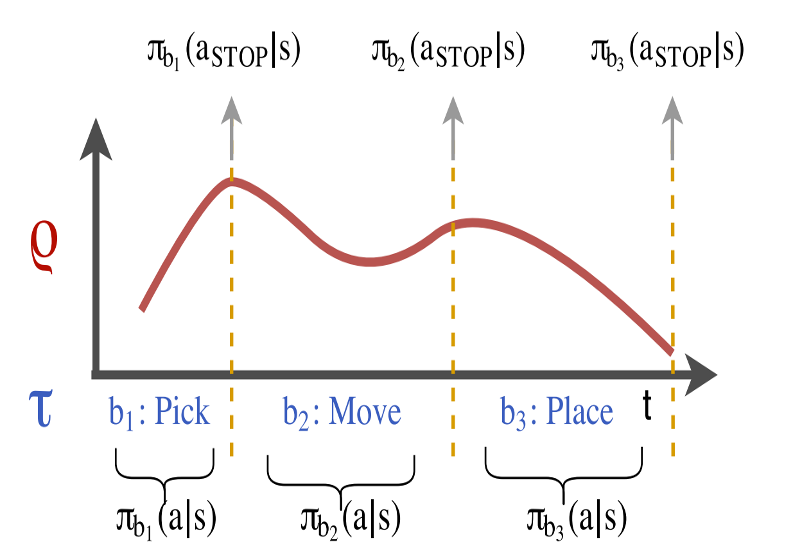
:::
:::::

## TACO: Temporal Alignment for Control

Objective: Maximise the joint log likelihood of the task sketch sequence $\tau$ and the action sequence $\mathbf{a}_\rho$ of a training trajectory $\rho$, conditioned on the state sequence $\mathbf{s}_{\rho}$ of $\rho$

$$
p(\tau, \mathbf{a}_\rho \mid \mathbf{s}_\rho) = \sum_{\zeta \in Z_{T, \tau}} p(\zeta \mid \mathbf{s}_\rho) \prod_{t=1}^{T} \pi_{\theta_{\zeta_t}} (a_t \mid s_t)
$$

$p(ζ |\mathbf{s}_ρ)$ is the product of the stop, $a_{STOP}$ , and nonstop, $ā_{STOP}$, probabilities associated with any given path.

Eg. T = 4, $\mathbf{s}_{\rho} = (s_1, s_2, s_3, s_4)$, $\tau = (b_1, b_2), \zeta = (b_1, b_1, b_2, b_2)$

$p(\zeta |\mathbf{s}_{\rho}) = \pi_{\theta_{b_1}}(\bar{a}_{STOP}|s_2)\,\pi_{\theta_{b_1}}(a_{STOP}|s_3)\,\pi_{\theta_{b_2}}(\bar{a}_{STOP}|s_4)$

No stop factor at $s_1$, since $\zeta_1 = \tau_1$ is fixed (Eq. 10 in the TACO paper).

## TACO: Temporal Alignment for Control

Problem: Impossible to compute all paths $\zeta$ in $Z_{T,\tau}$ for long sequence

Solution: Dynamic Programming

The (joint) likelihood of being at sub-task $l$ at time $t$ can be formulated in terms of **forward variables**:

$$
\alpha_t(l) := \sum_{\zeta_{1:t} \in Z_{t, \tau_{1:l}}} p(\zeta \mid \mathbf{s}_\rho) \prod_{t' = 1}^{t} \pi_{\theta_{\zeta_{t'}}}(a_{t'} \mid s_{t'})
$$

## TACO: Temporal Alignment for Control

::::: columns
::: {.column .small-math width="50%"}
 

$\alpha_1(l) = \begin{cases}
\pi_{\theta_{b_1}}(a_1|s_1), & \text{if } l = 1, \\
0, & \text{otherwise}.
\end{cases}$

$\alpha_t(l) = \pi_{\theta_{b_l}}(a_t|s_t) \left[ \alpha_{t-1}(l-1) \pi_{\theta_{b_{l-1}}}(a_{STOP}|s_t) \right.$

$\left. + \alpha_{t-1}(l)(1 - \pi_{\theta_{b_l}}(a_{STOP}|s_t)) \right].$

 

$\alpha_T(L) = p(\tau, \mathbf{a}_\rho|\mathbf{s}_\rho).$
:::

::: {.column width="50%"}
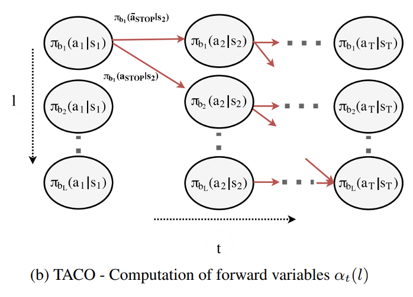
:::
:::::

Training: Maximize $\sum_{\rho} \log \alpha_T(L)$ over all demonstrations, w.r.t. the sub-policy parameters $\theta=(\theta_1, ..., \theta_K)$, which define both the action policies $\pi_{\theta_k}(a|s)$ and the stop policies $\pi_{\theta_k}(a_{STOP}|s)$

## Experiments: Nav-World

::::: columns
::: {.column width="50%"}
Setup:

-   The agent (blue) receives a route as a task sketch.
-   𝛕 = (black, green, yellow, red)
-   State space: (x, y) distance from each of the destination points
-   Action space: $(v_x, v_y)$ - the velocity

Training:

-   Provided with state-action trajectories ⍴ and the task sketch.
-   At the end of learning, the agent learns four sub-policies
:::

::: {.column width="50%"}
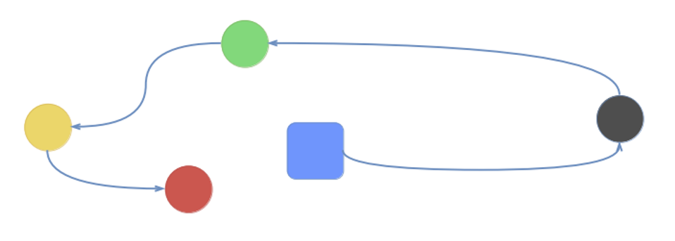

  

Test:

-   Given an unseen task sketch.
-   Considered successful if the agent visits all destinations in the correct order
:::
:::::

## Experiments: Nav-World

::::: columns
::: {.column width="50%"}
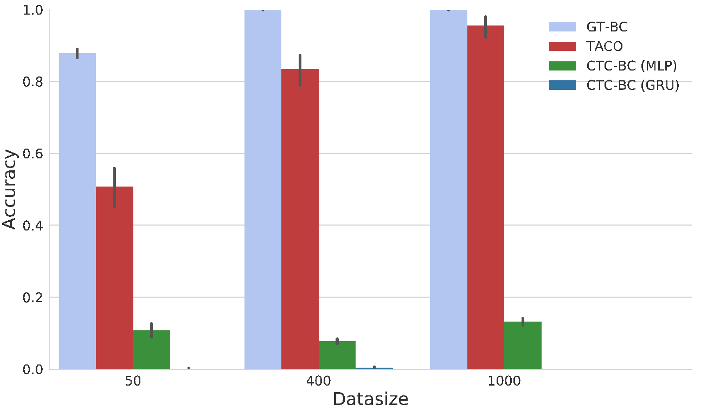
:::

::: {.column width="50%"}
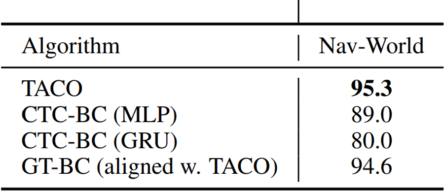
:::
:::::

## Experiments: Dial Domain

::::: columns
::: {.column width="50%"}
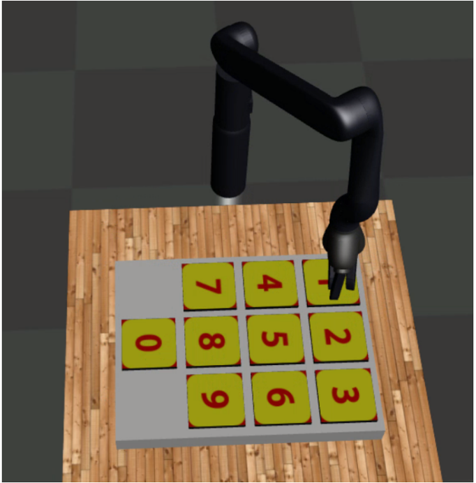
:::

::: {.column width="50%"}
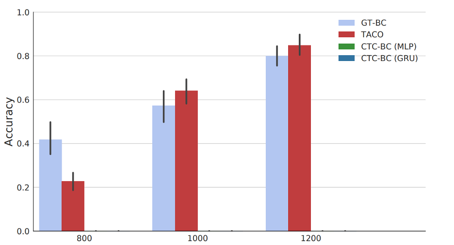
:::
:::::

## Summary: TACO - Temporal Alignment for Control

-   Modular LfD

-   Weak supervision - task sketch

-   Optimising the sub-policies over a distribution of possible alignments

## Future Work & Limitation

Limitation:

-   Sub-tasks in the task sketch have to be placed in the correct order

 

Future work:

-   Task sketches are dissimilar to natural human communication. Combination of TACO with architectures that can handle natural language.

-   Hierarchical task decomposition.

## Today’s agenda

::: grey-text
• Learning programs based on execution traces (NPI - Neural Programmer Interpreters)

• Extending NPI for video-based robot imitation (NTP - Neural Task Programming)

• Inferring sub-task boundaries (TACO - Temporal Alignment for Control)
:::

• Learning to search in Task and Motion Planning (TAMP)

• Generalization through imitation – using hierarchical policies

• Compositional generalization in diffusion planning

::: aside
Acknowledgments\
Today’s slides are based on student presentations from 2019 by: Zeqi Li, Angran Li, Zihan Fu
:::

## Task and Motion Planning

::::: columns
::: {.column width="50%"}
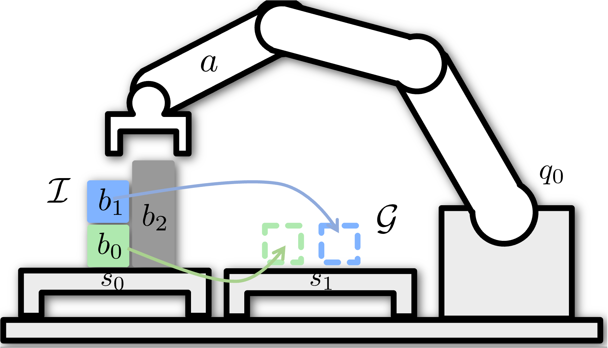
:::

::: {.column width="50%"}
[Goal]{.underline}: move [green box]{.green} and [blue box]{.blue-text} on the goal surface

[Problem]{.underline}: [grey box]{.grey-text} is obstructing

[Task plan]{.underline}:

1.  move [grey box]{.grey-text} where it doesn’t obstruct
2.  move [blue box]{.blue-text} on goal surface
3.  move [green box]{.green} on goal surface
:::
:::::

## Task and Motion Planning

::::: columns
::: {.column .red-annotation width="50%"}

Discrete action space: 3 objects x 4 operations\
Continuous action space: 5 joint angles on the robot arm x T timesteps
:::

::: {.column width="50%"}
find-grasp(b, hand)

place(b, hand, sur face)

find-traj(hand, goal)

collides(arm, b, objects)

 

$b \in \{b_0, b_1, b_2 \}$
:::
:::::

## Task and Motion Planning

::::: columns
::: {.column .red-annotation width="50%"}

Discrete action space: M objects x N operations\
Continuous action space: 5 joint angles on the robot arm x T timesteps
:::

::: {.column width="50%"}
find-grasp(b, hand)

place(b, hand, sur face)

find-traj(hand, goal)

collides(arm, b, objects)

pour(b, b')

stir(b)

shake(b)

.\
.\
.
:::
:::::

## Task and Motion Planning

::::: columns
::: {.column .red-annotation width="50%"}

Discrete action space: M objects x N operations\
Continuous action space: 5 joint angles on the robot arm x T timesteps
:::

::: {.column .small-math width="50%"}
Discrete + Continuous Optimization

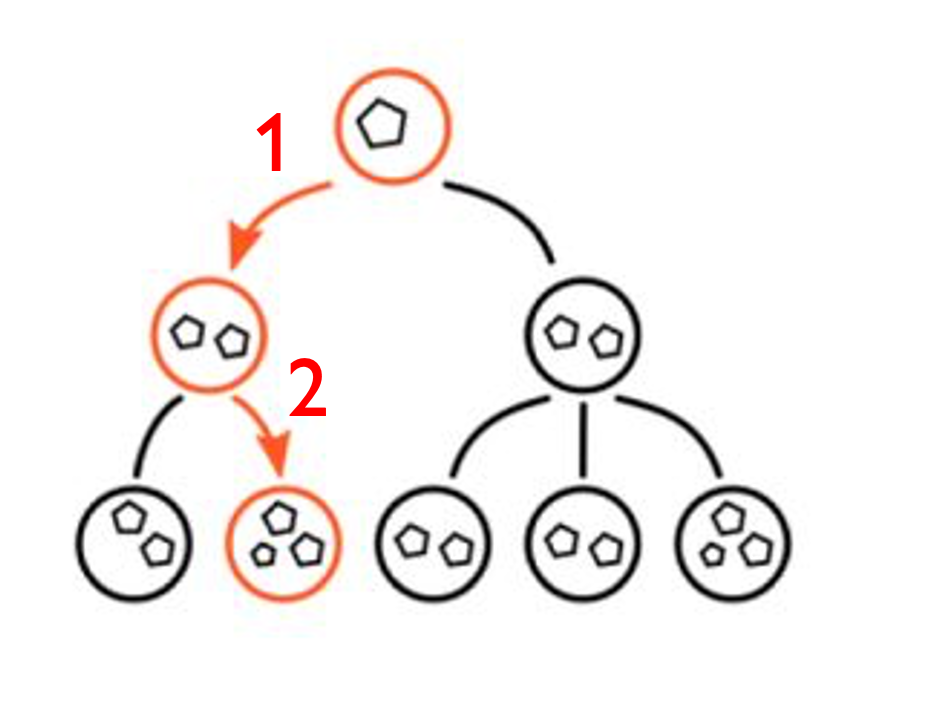{height="250"}

Expanding 1 and 2 requires solving continuous optimization problems with constraints
:::
:::::

## Solubility experiment



[<https://www.youtube.com/watch?v=NjpZmaKQWls>]{.tiny-font}

## [Constrained Motion Planner to Avoid Spilling]{.medium}



[<https://www.youtube.com/watch?v=NjpZmaKQWls>]{.tiny-font}

##  {.center}

These plans are useful, but unfortunately discrete + continuous optimization is [slow]{.red}

Q: How can we [learn to plan]{.red} from past experience of having solved similar problems?

## [Learning to Rank Objects and Operations from Past Experience]{.medium}

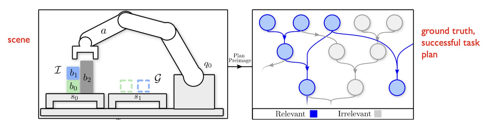{fig-align="center"}

## [Learning to Rank Objects and Operations from Past Experience]{.medium}

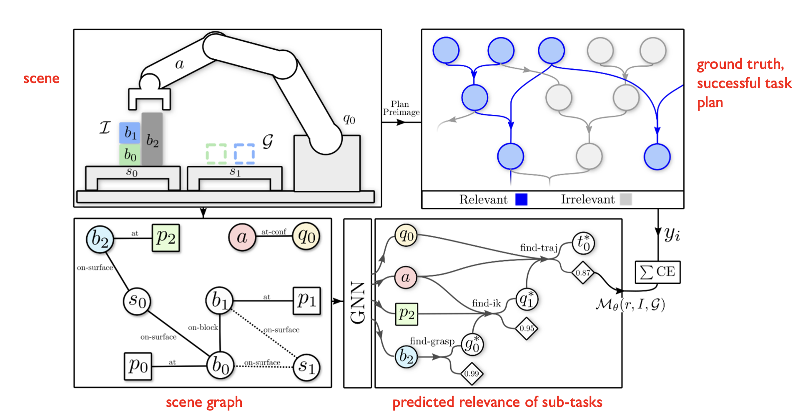{fig-align="center"}

## 



[<https://www.youtube.com/watch?v=pzzpR4wh_Zk&t=15s>]{.tiny-font}

## Learned (Informed) Planner Finds Solutions Faster

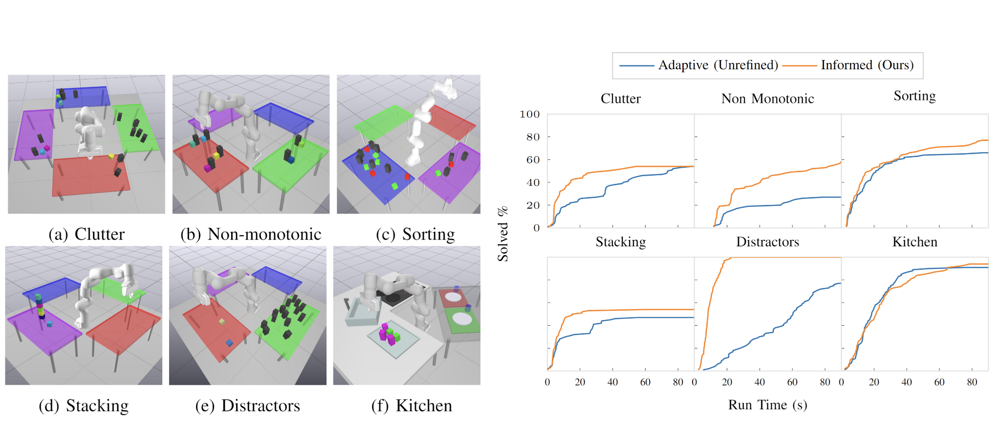

[\*Learning to Search in Task and Motion Planning with Streams, Khodeir et al, Robotics and Automation Letters. 2022]{.tiny-font}

## Automated Planning Domain Inference for Task and Motion Planning {.center}

Jinbang Huang, Allen Tao, Rozilyn Marco, Miroslav Bogdanovic, Jonathan Kelly, Florian Shkurti

ICRA 2025

[<https://arxiv.org/abs/2410.16445>]{.tiny-font}

## [Motivation: who writes the planning domain?]{.medium}

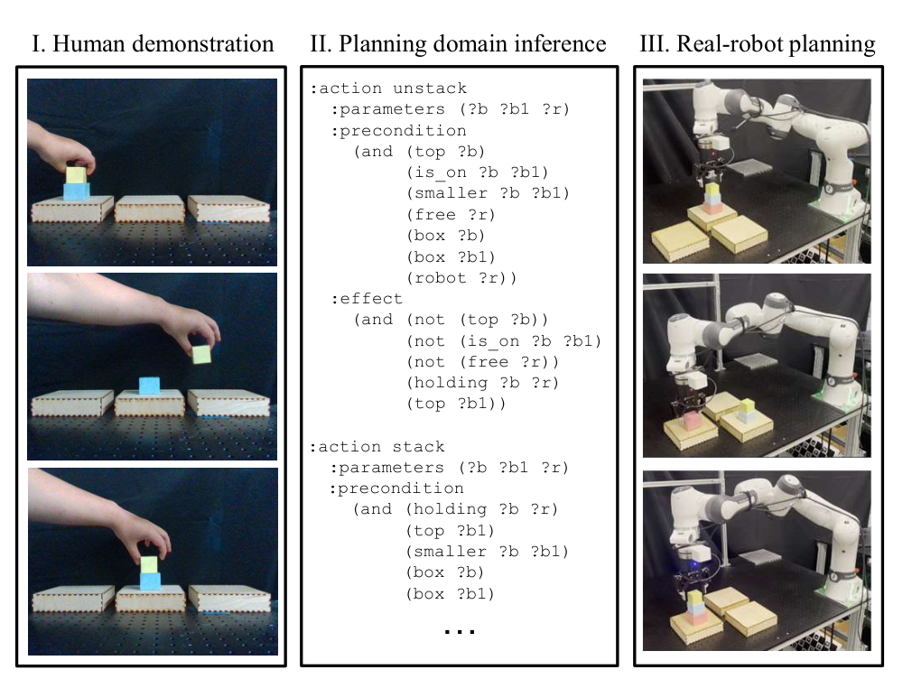{height="380" fig-align="center"}

-   Goal: [infer the planning domain]{.red} of a new task from one (or a few) human demonstrations, then plan with a standard TAMP planner
-   Unlike behavioural cloning of the planner, only the domain is learned. The search is still done by the planner, which helps generalize to more objects

## Problem setting

 

[Given]{.underline}: candidate predicates $\mathbf{P}$, e.g. `(is_on ?o1 ?o2)`, and actions $\mathbf{A}$, e.g. `stack`, `cook`, each with its motion planner

[Find]{.underline}: a planning domain $\mathbf{D}$, i.e. a subset of $\mathbf{P}$ and $\mathbf{A}$, plus each action's preconditions and effects

-   From one demonstration $\tau_e$ and a few unsolved validation problems $\mathbf{Q}_v$
-   [Complete]{.red} domain: can solve the task. [Optimal]{.red} domain: complete, with the fewest predicates and actions

## Method overview

-   [Training]{.underline}: from TAMP problems of 9 basic tasks (30 demonstrations each, 2-4 objects), learn estimators that score the relevance $u \in [0, 1]$ of every predicate and action

-   [Testing]{.underline}: predict the relevance scores from the demonstration, convert the most likely domain to PDDL, then refine it by search using $\mathbf{Q}_v$. If no domain solves $\mathbf{Q}_v$, ask for more demonstrations

## Predicate and action estimators

::::: columns
::: {.column width="60%"}
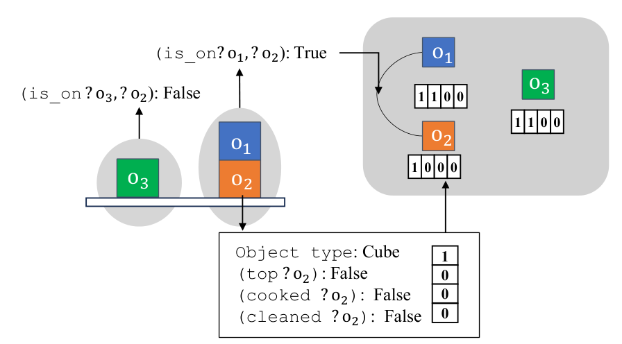{width="100%"}
:::

::: {.column width="40%"}
 

-   Initial and goal states as scene graphs: objects are nodes, predicates are node features and edges

-   Graph attention network → relevance score $u_p, u_a \in [0, 1]$ for every predicate and action
:::
:::::

Score of a candidate domain with predicates and actions $\omega_\mathbf{D}$:

$$
u_\mathbf{D} = \prod_{p \in \omega_\mathbf{D}} u_p \prod_{p \notin \omega_\mathbf{D}} (1 - u_p) \prod_{a \in \omega_\mathbf{D}} u_a \prod_{a \notin \omega_\mathbf{D}} (1 - u_a)
$$

The best-scoring $\omega_\mathbf{D}^{top}$ is the initial guess. The rest are ranked by score in a priority list $L$

## Generate-and-test domain search

::::: columns
::: {.column width="45%"}
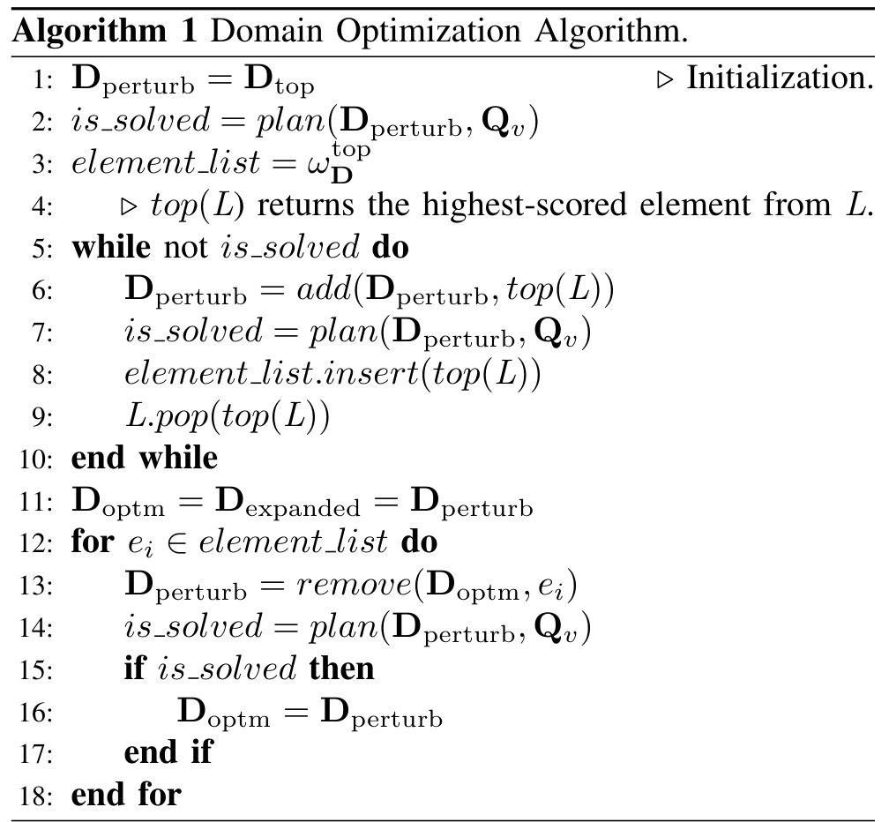
:::

::: {.column .medium width="55%"}
-   $\omega_\mathbf{D}^{top}$ → PDDL domain $\mathbf{D}_{top}$, using the demonstration:
    -   Precondition of an action: intersection of its pre-images (logical state just before the action) over all its instances
    -   Effect: intersection of its post-images, keeping only the predicates that changed

-   [Expansion]{.underline}: add the highest-scored element of $L$ until the domain solves all of $\mathbf{Q}_v$

-   [Contraction]{.underline}: try removing each element. Keep the removal if $\mathbf{Q}_v$ is still solved

-   Assumes that a subdomain of an incomplete domain is incomplete, and that the optimal domain is contained in any complete domain

-   Each `plan` call queries the motion planners, which dominates the cost. A good initial guess means few calls
:::
:::::

## [Results: more objects and new tasks]{.medium}

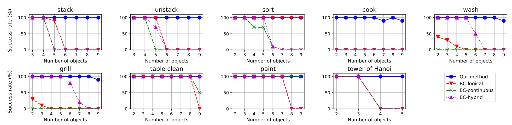{width="100%"}

::::: columns
::: {.column .medium width="45%"}
-   One demonstration per task at test time. Test problems have up to 9 objects, training problems at most 4
-   Behavioural cloning baselines: graph attention policies that predict the next logical action from logical, continuous or hybrid object states
-   Inferred domains stay above 90% success up to 9 objects, while the baselines degrade on complex tasks
:::

::: {.column .small-math width="55%"}
Unseen composed tasks, one demonstration each (success rate % vs. number of objects):

| Task            | 3   | 4   | 5   | 6   | 7   | 8   | 9   |
|------------------|-----|-----|-----|-----|-----|-----|-----|
| Cook and plate   | 100 | 100 | 100 | 100 | 100 | 40  | 50  |
| Unpack and cook  | 100 | 100 | 100 | 100 | 100 | 80  | 50  |
| Label            | 100 | 100 | 100 | 100 | 100 | 100 | 100 |
:::
:::::

## [Results: search cost and real robot experiments]{.medium}

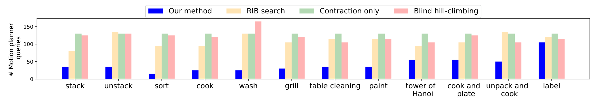{width="100%"}

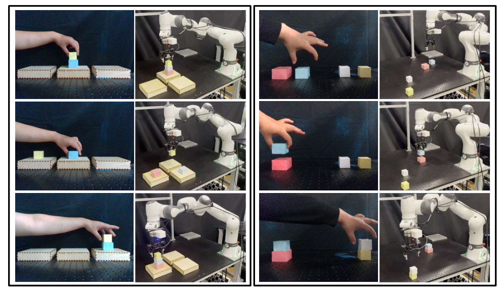{width="60%"}

## Today’s agenda

::: grey-text
• Learning programs based on execution traces (NPI - Neural Programmer Interpreters)

• Extending NPI for video-based robot imitation (NTP - Neural Task Programming)

• Inferring sub-task boundaries (TACO - Temporal Alignment for Control)

• Learning to search in Task and Motion Planning (TAMP)
:::

• Generalization through imitation – using hierarchical policies

• Compositional generalization in diffusion planning

## 



## Today’s agenda

::: grey-text
• Learning programs based on execution traces (NPI - Neural Programmer Interpreters)

• Extending NPI for video-based robot imitation (NTP - Neural Task Programming)

• Inferring sub-task boundaries (TACO - Temporal Alignment for Control)

• Learning to search in Task and Motion Planning (TAMP)

• Generalization through imitation – using hierarchical policies
:::

• Compositional generalization in diffusion planning

## [What do you need for compositional generalization in diffusion planning?]{.medium}

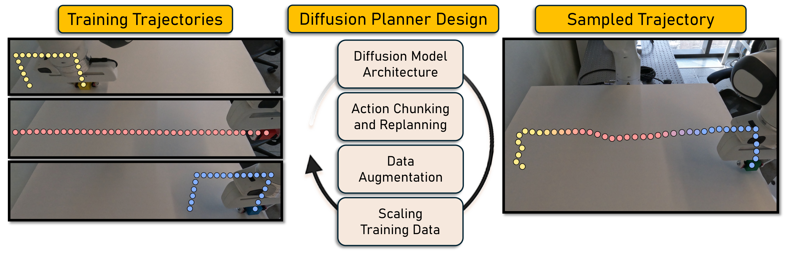{width="100%"}

-   Diffusion planners trained via imitation (generative behavioural cloning), not RL
-   [Compositional generalization]{.red}: generating new trajectories by stitching together sub-trajectories from different demonstrations
-   Which design choices enable it?

[What Do You Need for Compositional Generalization in Diffusion Planning? Quentin Clark and Florian Shkurti. CoRL 2026. <https://arxiv.org/abs/2505.18083>]{.tiny-font}

## Popular diffusion planners memorize

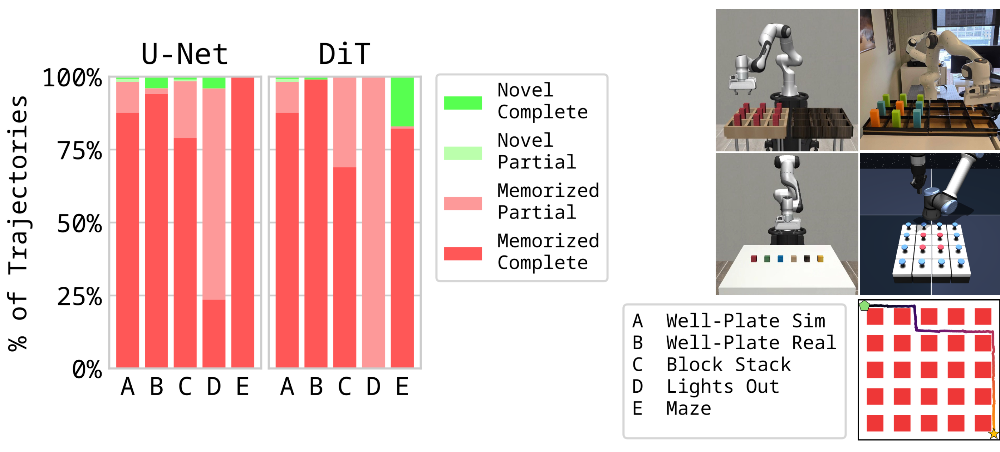{height="360" fig-align="center"}

::: medium
-   [Memorized]{.red}: every sub-task of the generated trajectory appears together in a single training trajectory. [Novel]{.green}: requires combining parts of two or more training trajectories
-   Complete: as many sub-tasks as a training trajectory. Partial: fewer
:::

## Eq-Net design

::::: columns
::: {.column width="55%"}
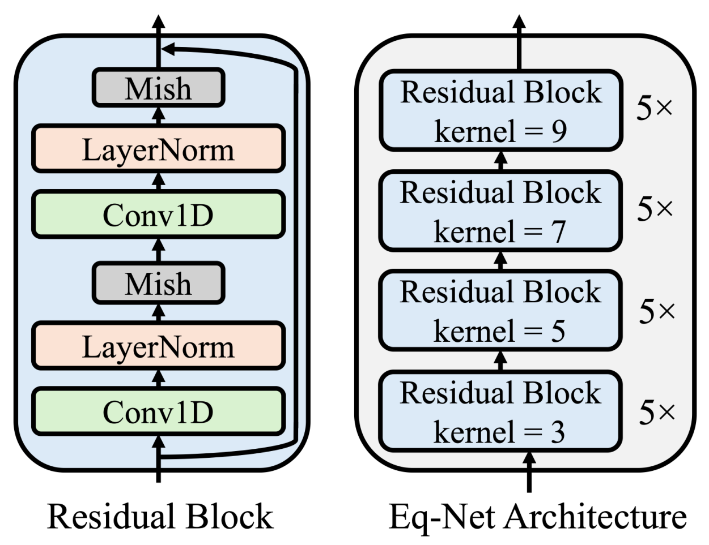{width="100%"}
:::

::: {.column width="45%"}
  

A ResNet CNN with:

-   Small convolution kernels
-   No max-pooling
-   No indexed upsampling

 

✅ Local receptive fields

✅ Shift-equivariance
:::
:::::

## Eq-Net memorizes less

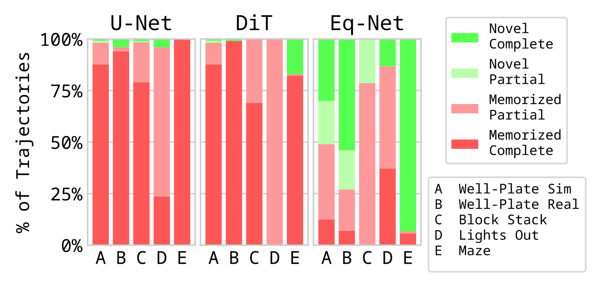{height="420" fig-align="center"}

Eq-Net generates many more novel trajectories than U-Net and DiT backbones

## Locality vs dataset size

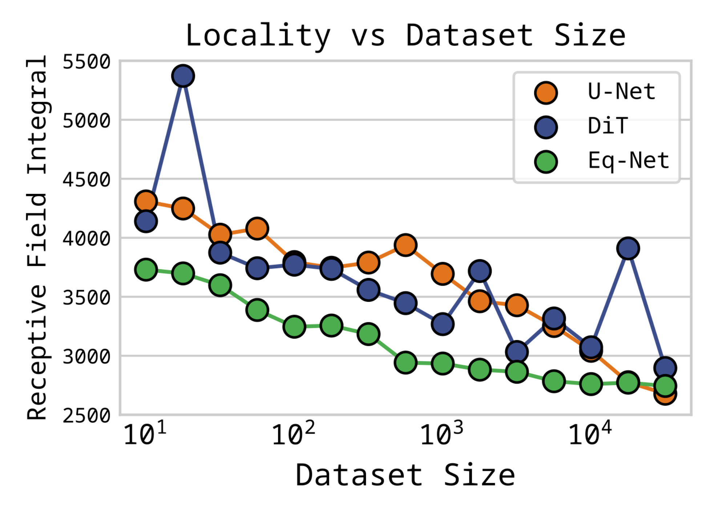{height="400" fig-align="center"}

Lower receptive field integral = more local. Models trained on more data are more local, and Eq-Net is local even with little data

## More data induces local receptive fields

::::: columns
::: {.column width="60%"}
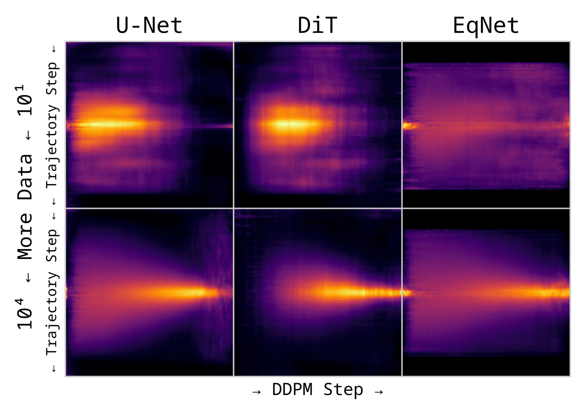{width="100%"}

[Gradient of the center state w.r.t. the trajectory]{.medium}
:::

::: {.column width="40%"}
  

Low-data regime: large receptive fields

   

High-data regime: small receptive fields
:::
:::::

## Compositionality vs dataset size

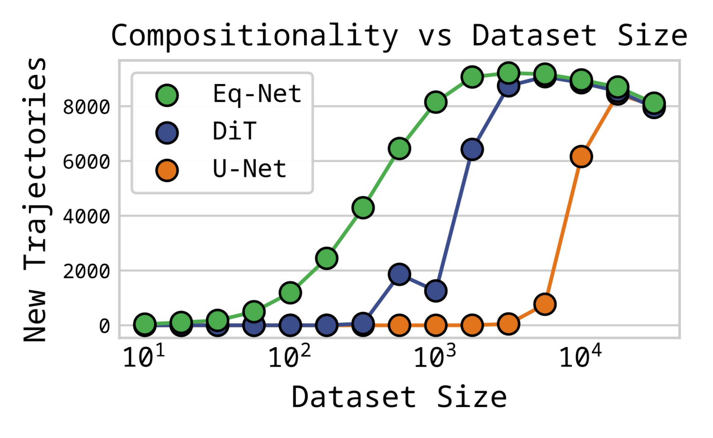{height="400" fig-align="center"}

Eq-Net composes with much less data. U-Net and DiT only start composing once the dataset is large enough to make them local

## Locality matters more than equivariance

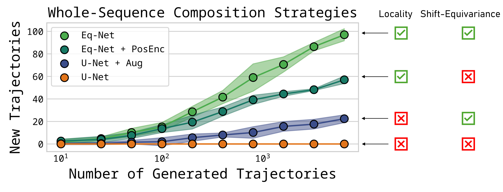{width="100%"}

Positional encodings remove shift-equivariance from Eq-Net, and data augmentation adds it to U-Net. Locality alone helps more than shift-equivariance alone, and both together work best

## Locality matters more than equivariance

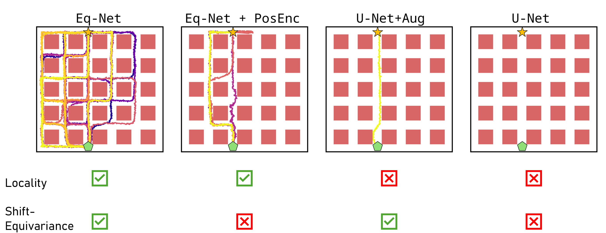{width="100%"}

## Different routes to compositionality

::::: columns
::: {.column width="60%"}
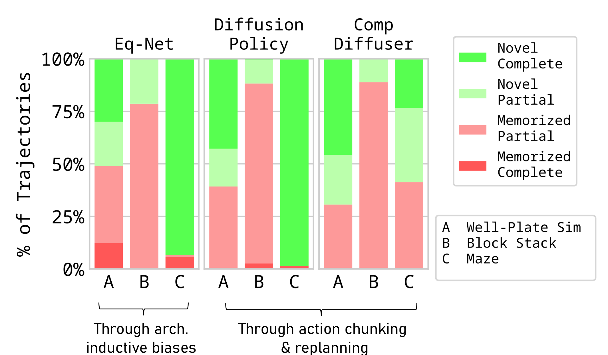{width="100%"}
:::

::: {.column width="40%"}
 

-   Eq-Net: through architectural inductive biases (locality and shift-equivariance)

-   Diffusion Policy and CompDiffuser: through action chunking and replanning
:::
:::::