## Today’s agenda

• Adversarial optimization for imitation learning (GAIL)

• Adversarial optimization with multiple inferred behaviors (InfoGAIL)

• Model based adversarial optimization (MGAIL)

• Multi-agent imitation learning

::: aside
Acknowledgments\
Today’s slides are based on student presentations from 2019 by: Yeming Wen, Yin-Hung Chen , and Yuwen Xiong
:::

## Detour: solving MDPs via linear programming

$\underset{v}{\arg\min} \quad \underset{s \in S}{\sum} d_s v_s$

$\text{subject to:} \quad v_s \geq r_{s,a} + \gamma \underset{s' \in S}{\sum} T_{s,a}^{s'} v_{s'} \quad \forall s \in S, a \in A$

$\qquad \qquad \quad d$ is the initial state distribution.

  

::: right-align
Optimal policy

$\pi^*(s) = \underset{a \in A}{\text{argmax}} Q^*(s, a)$
:::

## Detour: solving MDPs via linear programming

$\underset{\mu}{\text{argmax}} \underset{s \in S, a \in A}{\sum} \mu_{s,a} r_{s,a}$

$\text{subject to} \quad \underset{a \in A}{\sum} \mu_{s',a} = d_{s'} + \gamma \underset{s \in S, a \in A}{\sum} T_{s,a}^{s'} \mu_{s,a} \quad \forall s' \in S$

$\qquad \qquad \quad \mu_{s,a} \geq 0$

 

::: right-align
Discounted state action counts / occupancy measure

$\mu(s,a) = \underset{t=0}{\sum}^{\infty} \gamma^t p(s_t = s, a_t = a)$

Optimal policy

$\pi^*(s) = \underset{a \in A}{\text{argmax}} \, \mu(s,a)$
:::

## Detour: solving MDPs via linear programming

::::: columns
::: {.column width="85%"}
$\underset{v}{\text{argmin}} \underset{s \in S}{\sum} d_s v_s$

$\text{subject to} \quad v_s \geq r_{s,a} + \gamma \underset{s' \in S}{\sum} T_{s,a}^{s'} v_{s'} \quad \forall s \in S, a \in A$

$\qquad \qquad \quad d$ is the initial state distribution

  

$\underset{\mu}{\text{argmax}} \underset{s \in S, a \in A}{\sum} \mu_{s,a} r_{s,a}$

$\text{subject to} \quad \underset{a \in A}{\sum} \mu_{s',a} = d_{s'} + \underset{s \in S, a \in A}{\sum} T_{s,a}^{s'} \mu_{s,a} \quad \forall s' \in S$

$\qquad \qquad \quad \mu_{s,a} \geq 0$
:::

::: {.column width="15%"}
Primal LP

    

 

Dual LP
:::
:::::

## Background

▶ **Definitions:** Action space $\mathcal{A}$ and sample space $\mathcal{S}$. $\Pi$ is the set of all policies. Also assume $P(s'|s,a)$ is the dynamics model. In this paper, $\pi_E$ denotes the expert policy.

▶ **Imitation Learning:** Learning to perform a task from expert demonstrations without querying the expert while training.

▶ **Behavioral cloning:** Its success depends on large amounts of data.

▶ **Inverse RL:** The paper adopts the maximum causal entropy IRL which fits a cost function $c$ with the following problem.

$$\pi^* = \arg \min_{\pi \in \Pi} -H(\pi) + \mathbb{E}_\pi[c(s,a)]$$

$$\tilde{c} = \arg \max_{c \in \mathcal{C}} \mathbb{E}_{\pi^*}[c(s,a)] - \mathbb{E}_{\pi_E}[c(s,a)]$$

where $H(\pi) = \mathbb{E}_\pi[-\log \pi(a|s)]$ is the entropy of the policy.

## Formulation

▶ We first study the policies found by RL on costs learned by IRL on the largest possible set of cost functions $\mathcal{C} = \{c : S \times A \to \mathbb{R}\}$.

▶ Also need to define a convex cost function regularizer $\psi : \mathbb{R}_{S \times A} \to \mathbb{R}$, which turns out to be important in this paper.

▶ Re-write the Eq. 1 as the following:

$$IRL_\psi(\pi_E) = \arg \max_{c \in \mathcal{C}} -\psi(c) + (\min_{\pi \in \Pi} -H(\pi) + \mathbb{E}_\pi[c(s,a)])$$

$$- \mathbb{E}_{\pi_E}[c(s,a)]$$

▶ Define $RL(c) = \arg \min_{\pi \in \Pi} -H(\pi) + \mathbb{E}_\pi[c(s,a)]$.\
Let $\tilde{c} \in IRL_\psi(\pi_E)$. We are interested in characterizing the induced policy $RL(\tilde{c})$.

## Derivations

▶ It is easier to characterize $RL(\tilde{c})$ if we transform optimization problems over policies into convex problems.

▶ So the paper introduces an occupancy measure $\rho_\pi : S \times A \to \mathbb{R}$:

$$\rho_\pi(s,a) = \pi(a|s) \sum_{t=0}^{\infty} \gamma^t P(s_t = s|\pi) \qquad (1)$$

It can be interpreted as the distribution of state-action pairs when roll-out with policy $\pi$.

▶ There is an **one-to-one** correspondence between policy and occupancy measure. It also allows us to re-write the expected cost as

$$\mathbb{E}_\pi[c(s,a)] = \sum_{s,a} \rho_\pi(s,a)c(s,a) \qquad (2)$$

## Derivations

▶ **Lemma 1:** If we define

$$\hat{H}(\rho) = -\sum_{s,a} \rho(s,a) \log(\rho(s,a)/\sum_{a'} \rho(s,a')) \qquad (3)$$

then we have $\hat{H}(\rho) = H(\pi_\rho)$ and $H(\pi) = \hat{H}(\rho_\pi)$. So we can represent the entropy of a policy $\pi$ with the occupancy measure $\rho_\pi$.

▶ **Lemma 2:** If we define,

$$L(\pi, c) = -H(\pi) + \mathbb{E}_\pi[c(s,a)]$$

$$\hat{L}(\rho, c) = -\hat{H}(\rho) + \sum_{s,a} \rho(s,a)c(s,a)$$

then we have $L(\pi, c) = \hat{L}(\rho_\pi, c)$ and $\hat{L}(\rho, c) = L(\pi_\rho, c)$. The Lemma allows us to transform the problem from optimizing $\pi$ to $\rho$.

## Convex Conjugate

▶ Given a function $f$, it can be represented by the supremum of all affine functions that are majorized by $f$.

▶ For any given slope $m$, there may be many different constants $b$ such that the affine function $\langle m, x \rangle - b$ is majorized by $f$. We only need the best such constant.

▶ That's what the convex conjugate $f^*$ does. Given a slope $m$, $f^*$ returns the best constant $b$ such that $\langle m, x \rangle - b$ is majorized by $f$. Thus,

$$f^*(m) = \sup_x \langle m, x \rangle - f(x)$$

▶ Note that $f^{**} = f$.

::: small-math
There is a nice visualization of convex conjugate at <https://remilepriol.github.io/dualityviz/>
:::

## Derivations

▶ By Lemma 2, if $\psi$ is a constant regularizer and $\tilde{c} \in IRL_\psi(\pi_E)$ and $\hat{\pi} \in RL(\hat{c})$, then $\rho_{\hat{\pi}} = \rho_{\pi_E}$.

▶ Furthermore, we can also get the main result of the paper

$$RL \circ IRL_\psi(\pi_E) = \arg \min_{\pi \in \Pi} -H(\pi) + \psi^*(\rho_\pi - \rho_{\pi_E}) \qquad (4)$$

where $\psi^*$ is the convex conjugate of $\psi$, which is defined as

$$\psi^*(m) = \sup_{x \in \mathbb{R}^{S \times A}} m^T x - \psi(x)$$

▶ It tells us that the $\psi$-regularized inverse RL seeks a policy whose occupancy measure is close to the expert's as measured by the convex function $\psi^*$.

▶ A good imitation learning algorithm boils down to a good choice of the regularizer $\psi$.

## Occupancy Measure Matching

▶ As we showed previously, if $\psi$ is a constant, then the resulting policy would have the same occupancy measures with expert at all states and actions.

▶ It is not practically useful because most of the occupancy measure of the expert values are exactly zero, due to the limited expert samples.

▶ Thus, exact occupancy measure matching will force the learned policy to never visit the unseen state-action pairs.

▶ If we restrict the class of cost function $\mathcal{C}$ to be convex and set the regularizer $\psi$ to be the indicator function of the set $\mathcal{C}$. Then optimization problem in (6) can be written as

$$\min_\pi -H(\pi) + \max_{c \in \mathcal{C}} \mathbb{E}_\pi[c(s,a)] - \mathbb{E}_{\pi_E}[c(s,a)] \qquad (5)$$

which is a entropy-regularized apprenticeship learning problem.

## Apprenticeship Learning

▶ Policy gradient method can be used to update the parameterized policy $\pi_\theta$ to optimize the apprenticeship objective, Eq. 7.

$$\nabla_\theta \max_{c \in \mathcal{C}} \mathbb{E}_{\pi_\theta}[c(s,a)] - \mathbb{E}_{\pi_E}[c(s,a)] = \nabla_\theta \mathbb{E}_{\pi_\theta}[c^*(s,a)]$$

$$= \mathbb{E}_{\pi_\theta}[\nabla_\theta \log \pi_\theta(a|s) Q_{c^*}(s,a)]$$

where

$$c^* = \arg \max_{c \in \mathcal{C}} \mathbb{E}_{\pi_\theta}[c(s,a)] - \mathbb{E}_{\pi_E}[c(s,a)] \qquad (6)$$

$$Q_{c^*}(\bar{s}, \bar{a}) = \mathbb{E}_{\pi_\theta}[c^*(\bar{s}, \bar{a})|s_0 = \bar{s}, a_0 = \bar{a}] \qquad (7)$$

▶ Fit $c_i^*$ as defined above. Analytical solution is feasible if $\mathcal{C}$ is restricted to Convex or Linear cost classes.

▶ Given the $c_i^*$, compute the policy gradient and take a TRPO step to produce $\pi_{\theta_{i+1}}$.

## GAIL

▶ Apprenticeship learning via TRPO is tractable in large environments but is incapable of exactly matching occupancy measures without careful tuning due to the restrictive cost classes $\mathcal{C}$.

▶ Constant regularizer $\psi$ leads to exact matching but is intractable in large environments. Thus, GAIL is proposed to combine the best of both methods.

$$
\psi_{GA}(c) \triangleq \begin{cases} 
\mathbb{E}_{\pi_E}[g(c(s,a))] & \text{if } c < 0 \\
+\infty & \text{otherwise}
\end{cases}
$$

where

$$
g(x) = \begin{cases}
-x - \log(1 - e^x) & \text{if } x < 0 \\
+\infty & \text{otherwise}
\end{cases}
$$

## GAIL

▶ The GAIL regularizer $\psi_{GA}$ places low penalty on cost functions $c$ that assign an amount of negative cost to expert state-action pairs; It havily penalizes $c$ if it assigns large cost to the expert.

▶ $\psi_{GA}$ is an average over expert data so it can adjust to arbitrary expert datasets.

▶ In comparison, if $\psi$ is an indicator function (Apprenticeship Learning), then it's always fixed.

▶ Another property of $\psi_{GA}$ is its convex conjugate $\psi_{GA}^*(\rho_\pi - \rho_{\pi_E})$ can be derived in the following form:

$$\max_{D \in (0,1)^{S \times A}} \mathbb{E}_\pi[\log(D(s,a))] + \mathbb{E}_{\pi_E}[\log(1 - D(s,a))] \qquad (8)$$

▶ It can be interpreted to find a discriminator that distinguishes trajectory between learned policy and expert policy. t

## GAIL

▶ Combining with the main result Eq. (6) in the paper,

$$RL \circ IRL_\psi(\pi_E) = \arg \min_{\pi \in \Pi} -H(\pi) + \psi^*(\rho_\pi - \rho_{\pi_E})$$

The imitation learning problem is equivalent to find a saddle point $(\pi, D)$ of the expression

$$\mathbb{E}_\pi[\log(D(s,a))] + \mathbb{E}_{\pi_E}[\log(1 - D(s,a))] - \lambda H(\pi) \qquad (9)$$

▶ In terms of implementation, we just need to fit a parameterized policy $\pi_\theta$ with weights $\theta$ and a discriminator network $D_w : S \times A \to (0,1)$ with weights $w$.

▶ Update $D_w$ with Adam and update $\pi_\theta$ with TRPO iteratively.

## Algorithm

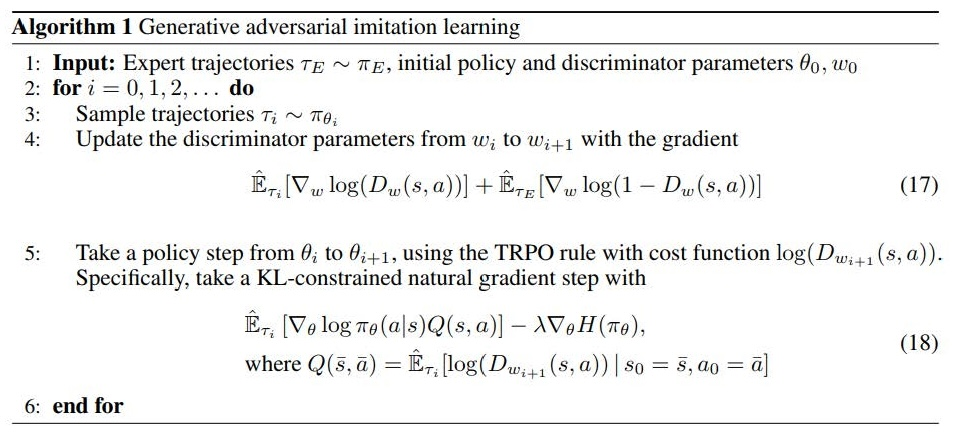{fig-align="center"}

## Results

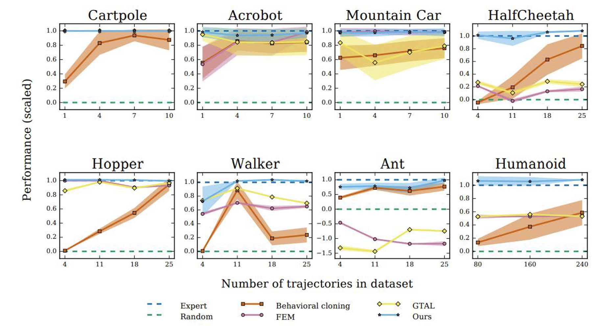{fig-align="center"}

## Today’s agenda

::: grey-text
• Adversarial optimization for imitation learning (GAIL)
:::

• Adversarial optimization with multiple inferred behaviors (InfoGAIL)

• Model based adversarial optimization (MGAIL)

• Multi-agent imitation learning

::: aside
Acknowledgments\
Today’s slides are based on student presentations from 2019 by: Yeming Wen, Yin-Hung Chen , and Yuwen Xiong
:::

## InfoGAIL: Interpretable Imitation Learning from Visual Demonstrations {.center}

Presenter: Yin-Hung Chen

# Motivation

## GAIL

A generator producing a policy 𝜋 competes with a discriminator distinguishing 𝜋 and the expert.

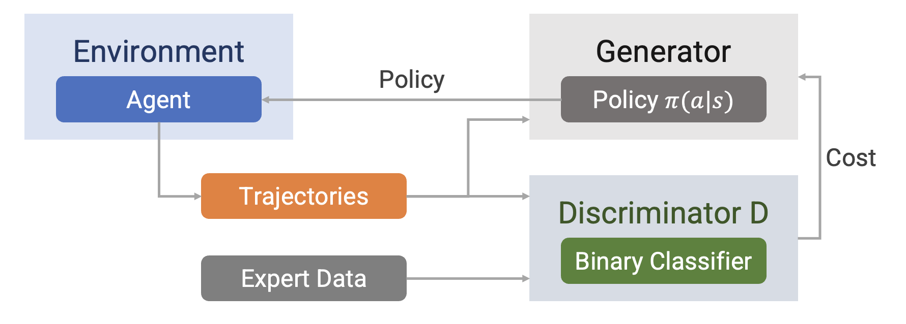

## Drawbacks of GAIL

-   Expert demonstrations can show significant **variability**.

-   The observations might have been sampled from **different experts with different skills and habits**.

-   **External latent factors** of variation are not explicitly captured by GAIL, but they can significantly affect the observed behaviors.

# InfoGAIL

## Modified GAIL

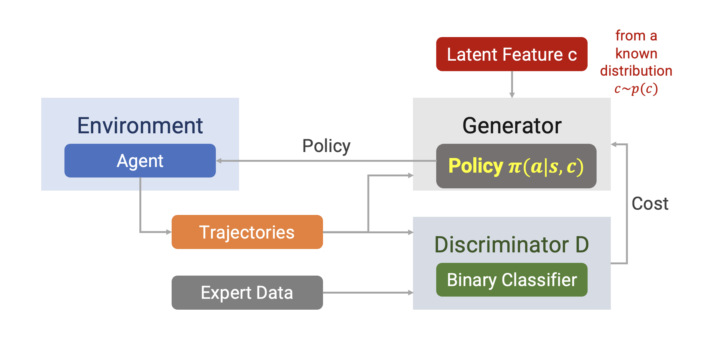

## Objective Function

GAIL: $$
\underset{\pi}{\min} \underset{𝐷\in(0,1)^{S×A}}{\max} + 𝔼_{𝜋_𝐸}  [ 𝑙𝑜𝑔(1 − 𝐷(𝑠, a))] − 𝜆𝐻(𝜋)
$$

where 𝜋 is learner policy, and $𝜋_𝐸$ is expert policy.

InfoGAIL:

-   Discriminator: same with GAIL
-   Generator: simply introducing latent factor c into 𝜋 → 𝜋 𝑎 𝑠, 𝑐\
    [However, applying GAIL to 𝜋(𝑎 \| 𝑠, 𝑐) could simply ignore c and fail to separate different expert behaviors → **adding more constraints over c**]{.orange}

## Constraints over Latent Features

There should be high mutual information between the latent factor c and learner trajectory τ.

$$
I(c; \tau) = \sum_{\tau} p(\tau) \sum_c p(c|\tau) \log_2 \frac{p(c|\tau)}{p(c)}
$$

Independence between c and trajectory τ:

$$
p(c|\tau) = \frac{p(c)p(\tau)}{p(\tau)}, \quad \frac{p(c|\tau)}{p(c)} = 1, \quad \log_2 \frac{p(c|\tau)}{p(c)} = 0
$$

Maximizing mutual information $I(c; \tau)$\
→ hard to maximize directly as it requires the posterior $P(c|\tau)$\
→ using $Q(c|\tau)$ to estimate $P(c|\tau)$ There should be high mutual information between the latent factor c and learner trajectory 𝜏.

## Constraints over Latent Features

Introducing the lower bound $L_I(\pi, Q)$ of $I(c; \tau)$

$$
\begin{align}
& I(c; \tau) \\
&= H(c) - H(c|\tau) \\
&= \mathbb{E}_{a \sim \pi(\cdot|s,c)} \left[ \mathbb{E}_{c' \sim P(c|\tau)} [log P(c'|\tau)] \right] + H(c) \\
&= \mathbb{E}_{a \sim \pi(\cdot|s,c)} \left[ D_{KL}(P(\cdot|\tau) \| Q(\cdot|\tau)) + \mathbb{E}_{c' \sim P(c|\tau)} [log Q(c'|\tau)] \right] + H(c) \\
&\geq \mathbb{E}_{a \sim \pi(\cdot|s,c)} \left[ \mathbb{E}_{c' \sim P(c|\tau)} [log Q(c'|\tau)] \right] + H(c) \\
&= \mathbb{E}_{c \sim P(c), a \sim \pi(\cdot|s,c)} [log Q(c|\tau)] + H(c) \\
&= L_I(\pi, Q)
\end{align}
$$

## Constraints over Latent Features

There should be high mutual information between the latent factor c and learner trajectory 𝜏.

 

Maximizing mutual information 𝐼(𝑐; 𝜏)\
→ hard to maximize directly as it requires the posterior 𝑃(𝑐\|𝜏)\
→ using 𝑄(𝑐\|𝜏) to estimate 𝑃(𝑐\|𝜏)

 

Maximizing 𝐼(𝑐; 𝜏) through maximize the lower bound 𝐿𝐼(𝜋, 𝑄)

## Objective Function

GAIL:

$$
\min_\pi \max_{D \in (0,1)^{S \times A}} \mathbb{E}_\pi [log D(s, a)] + \mathbb{E}_{\pi_E} [log(1 - D(s, a))] - \lambda H(\pi)
$$

where $\pi$ is learner policy, and $\pi_E$ is expert policy.

 

InfoGAIL:

$$
\min_{\pi,Q} \max_D \mathbb{E}_\pi [log D(s, a)] + \mathbb{E}_{\pi_E} [log(1 - D(s, a))] - \lambda_1 L_I(\pi, Q) - \lambda_2 H(\pi)
$$

$\qquad \qquad \qquad \qquad \qquad \qquad$ where $\lambda_1 > 0$ and $\lambda_2 > 0$.

## InfoGAIL

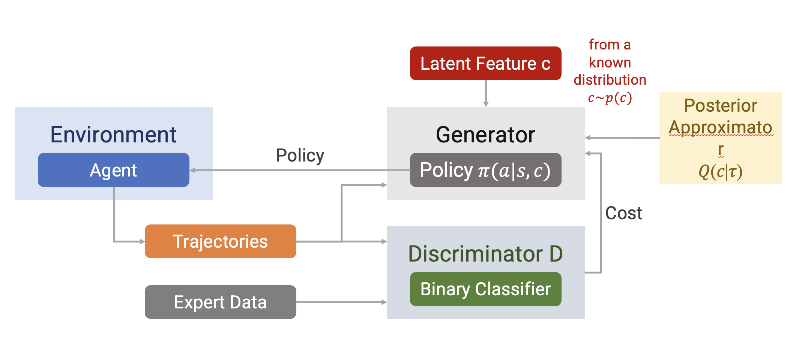

## 

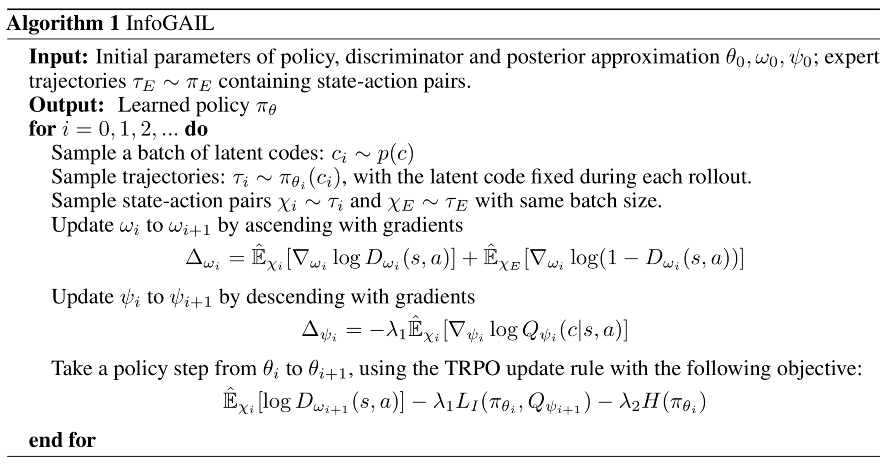

# Additional Optimization

## Improved Optimization

The traditional GAN objective suffers from vanishing gradient and mode collapse problems.\
Vanishing gradient

::::: columns
::: {.column width="40%"}
$$
\frac{\partial C}{\partial b_1} = \frac{\partial C}{\partial y_3} \frac{\partial y_3}{\partial z_3} \frac{\partial z_3}{\partial x_3} \frac{\partial x_3}{\partial z_2} \frac{\partial z_2}{\partial x_2} \frac{\partial x_2}{\partial z_1} \frac{\partial z_1}{\partial b_1}
$$

$$
= \frac{\partial C}{\partial y_{3}} \sigma'(z_{3}) w_{3} \sigma'(z_{2}) w_{2} \sigma'(z_{1})
$$

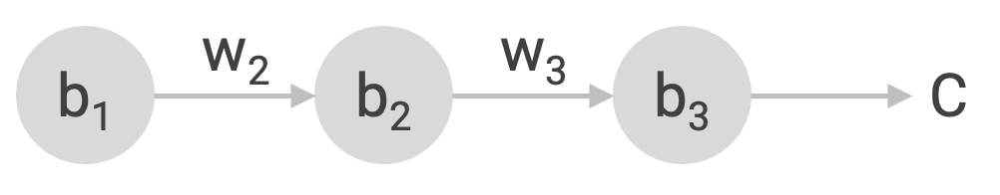
:::

::: {.column width="60%"}
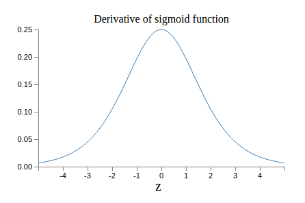{fig-align="right"}
:::
:::::

## Improved Optimization

The traditional GAN objective suffers from vanishing gradient and mode collapse problems.

 

Mode collapse: generator tends to produce the same type of data → generator yields the same G(z) for different z

## Improved Optimization

The traditional GAN objective suffers from vanishing gradient and mode collapse problems.

→ using the Wasserstein GAN (WGAN)

$$
\min_{\theta, \psi} \max_{\omega} \mathbb{E}_{\pi_\theta}[D_\omega(s, a)] - \mathbb{E}_{\pi_E}[D_\omega(s, a)] - \lambda_0 \eta(\pi_\theta) - \lambda_1 L_I(\pi_\theta, Q_\psi) - \lambda_2 H(\pi_\theta)
$$

## 

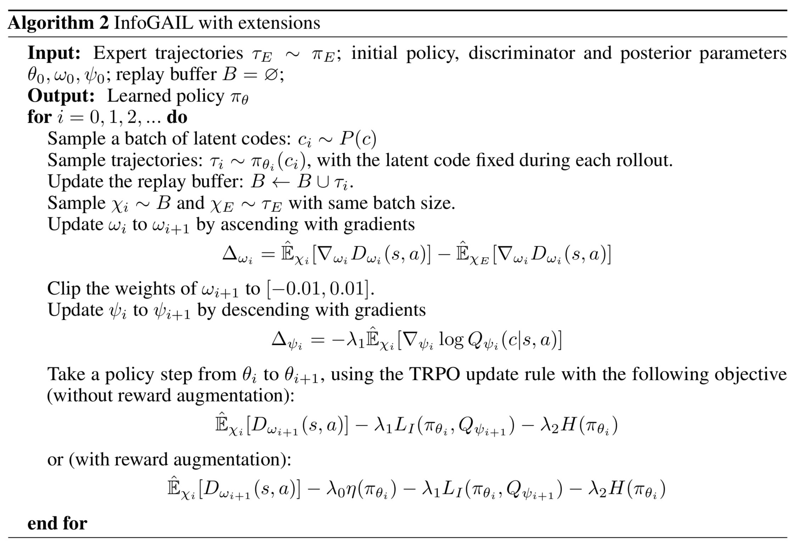

# Experiments

## Learning to Distinguish Trajectories

-   The observations at time t are positions from t − 4 to t.
-   The latent code is a one-hot encoded vector with 3 dimensions and a uniform prior.

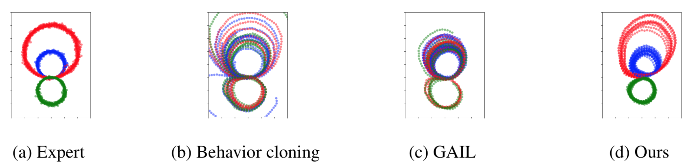

## Self-driving car in the TORCS Environment

• The demonstrations collected by manually driving

• Three-dimensional continuous action composed of steering, acceleration,and *braking*

• Raw visual inputs as the only external inputs for the state

• Auxiliary information as internal input, including velocity at time t, actions at time t − 1 and t − 2, and damage of the car

• Pre-trained ResNet on ImageNet

{fig-align="right"}

## 

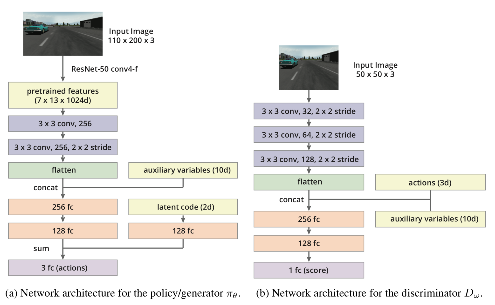

## Performance

**Turn**

\[0, 1\] corresponds to using the inside lane (blue lines), while \[1, 0\] corresponds to the outside lane (red lines).

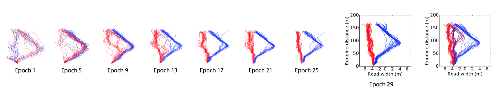

## Performance

**Pass**

\[0, 1\] corresponds to passing from right (red lines), while \[1, 0\] corresponds to passing from left (blue lines).

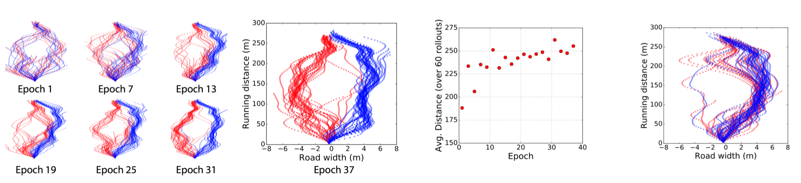

::: vertical-align
infoGAIL

GAIL
:::

## Performance

• Classification accuracies of 𝑄(𝑐\|𝜏)

• Reward augmentation encouraging the car to drive faster

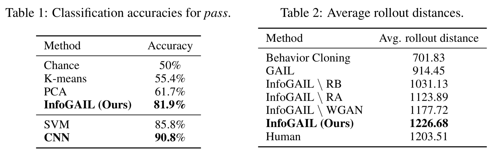

## 



[<https://www.youtube.com/watch?v=YtNPBAW6h5k>]{.small-math}

## Today’s agenda

::: grey-text
• Adversarial optimization for imitation learning (GAIL)

• Adversarial optimization with multiple inferred behaviors (InfoGAIL)
:::

• Model based adversarial optimization (MGAIL)

• Multi-agent imitation learning

::: aside
Acknowledgments\
Today’s slides are based on student presentations from 2019 by: Yeming Wen, Yin-Hung Chen , and Yuwen Xiong
:::

## Model-based Adversarial Imitation Learning {.center}

Nir Baram, Oron Anschel, Shie Mannor

Presented by Yuwen Xiong, Mar 1 st

## Recap: GAIL algorithm

$$
\underset{\pi}{\text{argmin}} \quad \underset{D \in (0,1)}{\text{argmax}} \mathbb{E}_{\pi}[\log D(s, a)] + \mathbb{E}_{\pi_E}[\log(1 - D(s, a))] - \lambda H(\pi)
$$

-   We use Adam to optimize the discriminator and use TRPO to optimize the policy
-   The optimization of the discriminator can be done by using backpropagation, but this is not the case for the optimization of the policy
-   $\pi$ affects the data distribution but do not appear in the objective itself
-   We use these two equations to get gradient estimation for $\pi_{\theta}$

$$
\nabla_{\theta} \mathbb{E}_{\pi}[\log D(s, a)] \cong \mathbb{\hat{E}}_{\tau_i}[\nabla_{\theta} \log \pi_{\theta}(a|s) Q(s, a)]
$$

$$Q(\hat{s}, \hat{a}) = \mathbb{\hat{E}}_{\tau_i}[\log D(s, a) \mid s_0 = \hat{s}, a_0 = \hat{a}]$$

## Motivation

-   A model-free approach like GAIL has its limitations
    -   The generative model can no longer be trained by simply backpropagating the gradient from the loss function defined over the discriminator
    -   Has to resort to high-variance gradient estimations

. . .

 

-   If we have a model-based version of adversarial imitation learning
    -   The system can be easily trained end-to-end using regular backpropagation
    -   The policy gradient can be derived directly from the gradient of the discriminator
    -   Policies can be more robust and training requires fewer interactions with the environment

## Algorithm - overview

:::::: columns
:::: {.column width="70%"}
The model-free approach treats the state s as fixed and only tries to optimize the behavior.

::: fragment
Instead, we treat s as a function of the policy: $$s' = f(s, a)$$

So that, by using the law of total derivative we can get:

$$
\begin{align}
\left.\nabla_{\theta} D(s_t, a_t)\right|_{s=s_t, a=a_t} &= \left.\frac{\partial D}{\partial a} \frac{\partial a}{\partial \theta}\right|_{a=a_t} + \left.\frac{\partial D}{\partial s} \frac{\partial s}{\partial \theta}\right|_{s=s_t} \\
&= \left.\frac{\partial D}{\partial a} \frac{\partial a}{\partial \theta}\right|_{a=a_t} + \frac{\partial D}{\partial s} \left(\left.\frac{\partial f}{\partial s} \frac{\partial s}{\partial \theta}\right|_{s=s_{t-1}} + \left.\frac{\partial f}{\partial a} \frac{\partial a}{\partial \theta}\right|_{a=a_{t-1}}\right)
\end{align}
$$
:::
::::

::: {.column width="30%"}
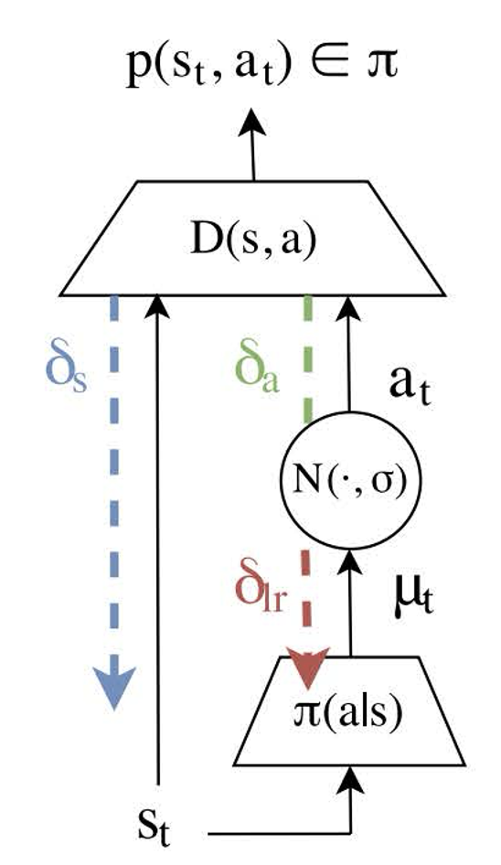{height="300"}
:::
::::::

## Algorithm - preparation

First, we know that $D(s, a) = p(y|s, a)$, where $y = \{\pi_E, \pi\}$

. . .

By using Bayes rule and the law of total probability we can get:

$$D(s, a) = p(\pi|s, a) = \frac{p(s, a|\pi)p(\pi)}{p(s, a)}$$

$$\qquad \qquad \qquad = \frac{p(s, a|\pi)p(\pi)}{p(s, a|\pi)p(\pi) + p(s, a|\pi_E)p(\pi_E)}$$

. . .

$$\qquad = \frac{p(s, a|\pi)}{p(s, a|\pi) + p(s, a|\pi_E)}$$

## Algorithm - preparation

Re-writing it as following:

$$
D(s, a) = \frac{1}{\frac{p(s,a|\pi)+p(s,a|\pi_E)}{p(s,a|\pi)}} = \frac{1}{1 + \frac{p(s,a|\pi_E)}{p(s,a|\pi)}} = \frac{1}{1 + \frac{p(a|s,\pi_E)}{p(a|s,\pi)} \cdot \frac{p(s|\pi_E)}{p(s|\pi)}}$$

. . .

Let $\varphi(s, a) = \frac{p(a|s,\pi_E)}{p(a|s,\pi)}$ and $\psi(s) = \frac{p(s|\pi_E)}{p(s|\pi)}$, we can get:

$$
D(s, a) = \frac{1}{1 + \varphi(s, a) \cdot \psi(s)}
$$

## Algorithm - preparation

Here $\varphi(s, a) = \frac{p(a|s,\pi_E)}{p(a|s,\pi)}$ stands for policy likelihood ratio

And $\psi(s) = \frac{p(s|\pi_E)}{p(s|\pi)}$ stands for state distribution likelihood ratio

. . .

By using differentiation rule we can easily get:

$$
\nabla_a D = -\frac{\varphi_a(s, a)\psi(s)}{(1 + \varphi(s, a)\psi(s))^2}
$$

$$
\nabla_s D = -\frac{\varphi_s(s, a)\psi(s) + \varphi(s, a)\psi_s(s)}{(1 + \varphi(s, a)\psi(s))^2}
$$

. . .

Recall what we need: $\left.\nabla_\theta D(s_t, a_t)\right|_{s=s_t,a=a_t} = \left.\frac{\partial D}{\partial a} \frac{\partial a}{\partial \theta}\right|_{a=a_t} + \left.\frac{\partial D}{\partial s} \frac{\partial s}{\partial \theta}\right|_{s=s_t}$

## Algorithm - re-parameterization of distribution

Assuming the policy is given by

$$
\pi_\theta(a|s) = \mathcal{N}(a|\mu_\theta(s), \sigma_\theta^2(s))
$$

. . .

We can rewrite it to

$$
\pi_\theta(a|s) = \mu_\theta(s) + \xi\sigma_\theta(s), \text{ where } \xi \sim \mathcal{N}(0, 1)
$$

. . .

So that we can get a Monte-Carlo estimator of the derivative

$$
\begin{align}
\nabla_\theta \mathbb{E}_\pi(a|s) D(s, a) &= \mathbb{E}_{\rho(\xi)} \nabla_a D(a, s) \nabla_\theta \pi_\theta(a|s) \\
& \cong \frac{1}{M} \sum_{i=1}^M \left.\nabla_a D(s, a) \nabla_\theta \pi_\theta(a|s)\right|_{\xi=\xi_i}
\end{align}
$$

## Algorithm

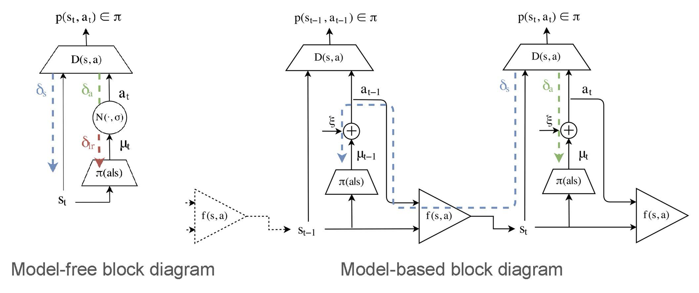

## Algorithm

To maximize the reward function, we can view reward as $r(s, a) = -D(s, a)$, and then maximizing the total reward is equivalent to minimizing the total discriminator beliefs along a trajectory.

. . .

So that we can define: $$
J(\theta) = \mathbb{E} \left[ \sum_{t=0} \gamma^t D(s_t, a_t) \mid \theta \right]
$$

And write down the derivatives: (this follows SVG paper \[Heess et al. 2015\]) $$
J_s = \mathbb{E}_{p(a\mid s)}\mathbb{E}_{p(s'\mid s,a)}\mathbb{E}_{p(\xi\mid s,a,s')} 
\left[ D_s + D_a\pi_s + \gamma J'_{s'}(f_s + f_a\pi_s) 
\right] 
$$

$$
J_\theta =  \mathbb{E}_{p(a\mid s)}\mathbb{E}_{p(s'\mid s,a)}\mathbb{E}_{p(\xi\mid s,a,s')}
[D_a\pi_\theta +  \gamma(J'_{s'}f_a\pi_\theta + J'_\theta)]
$$

## Algorithm

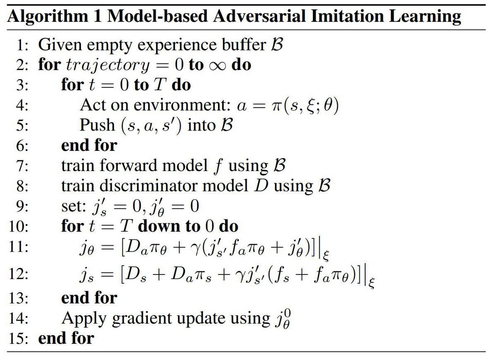

## Experiments

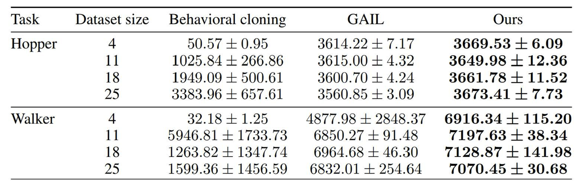

## Today’s agenda

::: grey-text
• Adversarial optimization for imitation learning (GAIL)

• Adversarial optimization with multiple inferred behaviors (InfoGAIL)

• Model based adversarial optimization (MGAIL)
:::

• Multi-agent imitation learning

::: aside
Acknowledgments\
Today’s slides are based on student presentations from 2019 by: Yeming Wen, Yin-Hung Chen , and Yuwen Xiong
:::